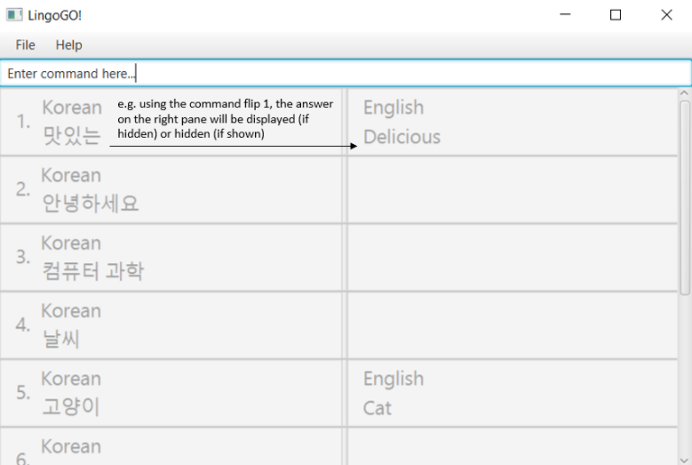

# LingoGO!
- LingoGO! is for university students who use English as their first language and are trying to learn a new language. It provides a fast way to generate flashcards so that students can memorise words faster.
- This is our [deployed project documentation](https://ay2122s1-cs2103t-t11-2.github.io/tp/).

## Acknowledgements
- This project is done as part of CS2103T at NUS. This project is based on the AddressBook-Level3 project created by the [SE-EDU initiative](https://se-education.org).
- We have used [opencsv](http://opencsv.sourceforge.net/) to read and write CSV files.
