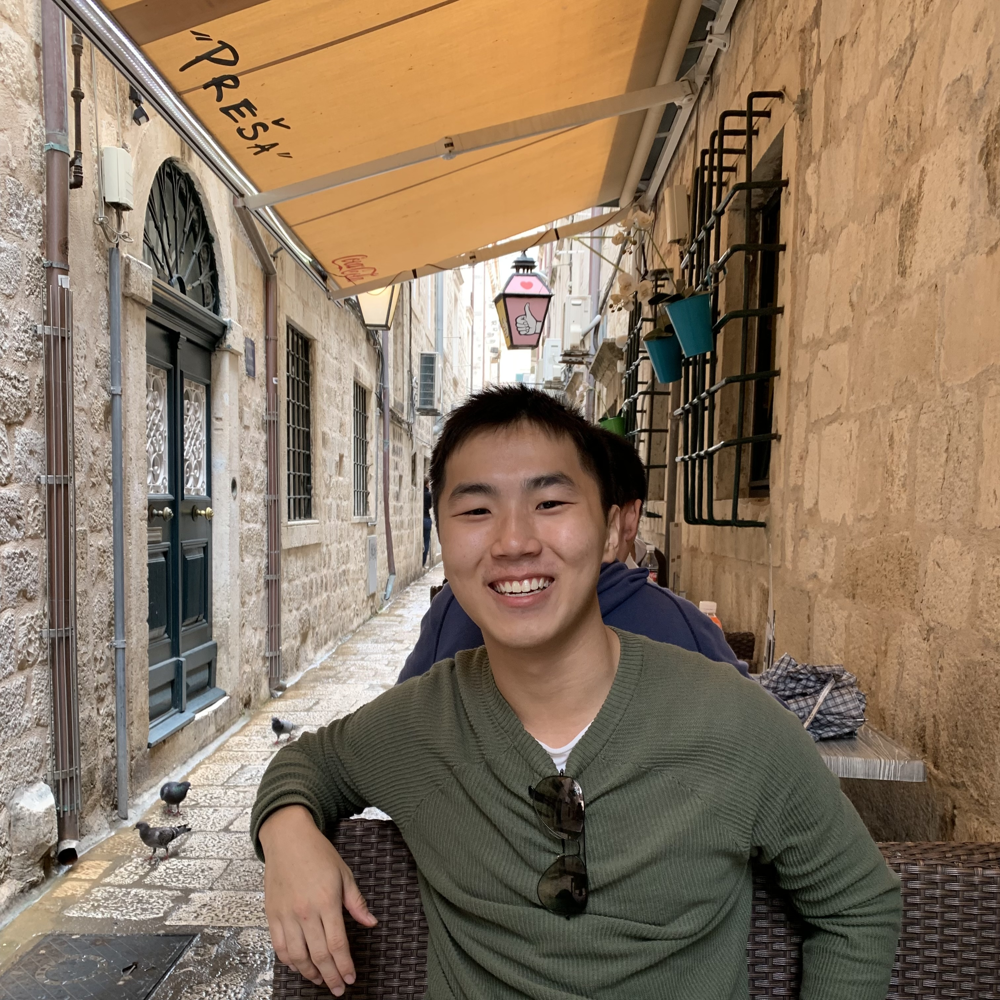
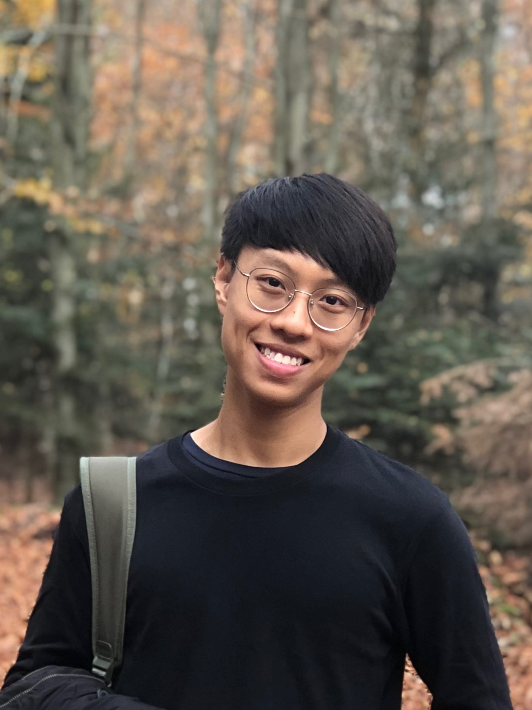
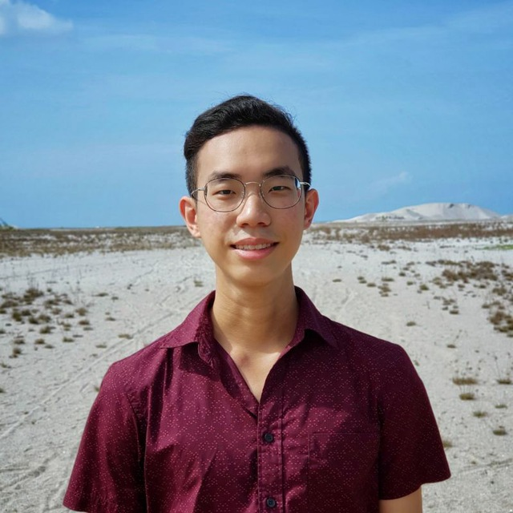
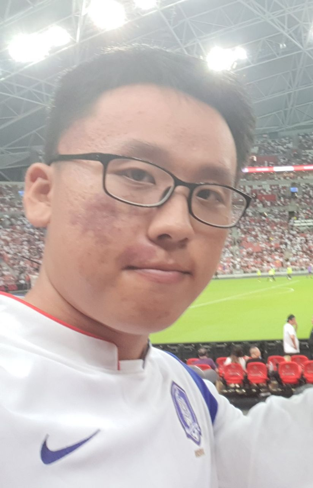
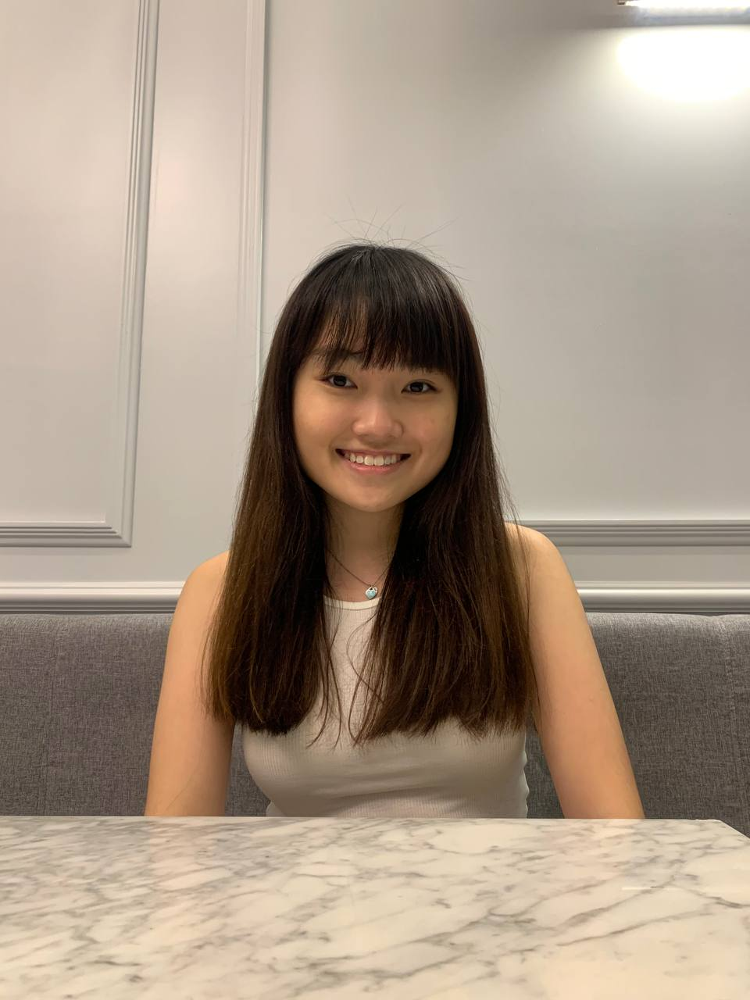

LingoGO! is a team project done as part of the module CS2103T (Software Engineering) at the
[School of Computing, National University of Singapore](http://www.comp.nus.edu.sg).

Feel free to check out our individual project portfolios below and reach out to us via email or LinkedIn!

## Project team

### Aiken Wong Xiheng

[[LinkedIn](https://www.linkedin.com/in/aikenwx/)]
[[GitHub](https://github.com/aikenwx)]
[[Email](mailto:aikenwongx@u.nus.edu)]
[[Portfolio](team/aikenwx.md)]

* Role: Developer
* Responsibilities: Documentation, `Storage` component

### Bryan Kwok Yan Fai

[[LinkedIn](https://www.linkedin.com/in/bryan-kwok/)]
[[GitHub](https://github.com/kwokieee)]
[[Email](mailto:bryankwokyf@u.nus.edu)]
[[Portfolio](team/kwokieee.md)]

* Role: Developer
* Responsibilities: Project scheduling and tracking, `Ui` component

### Chow En Rong

[[LinkedIn](https://www.linkedin.com/in/chowenrong/)]
[[GitHub](https://github.com/chownces)]
[[Email](mailto:chowenrong@u.nus.edu)]
[[Portfolio](team/chownces.md)]

* Role: Developer
* Responsibilities: Code quality, CI/CD, `Model` component

### Lee Jae Ho

[[LinkedIn](https://www.linkedin.com/in/leejaeho1997/)]
[[GitHub](https://github.com/jhlee1997)]
[[Email](mailto:e0564945@u.nus.edu)]
[[Portfolio](team/jhlee1997.md)]

* Role: Developer
* Responsibilities: Testing

### Sharmaine Cheong Shi Min

[[LinkedIn](https://www.linkedin.com/in/sharmaine-cheong/)]
[[GitHub](https://github.com/sharmainec)]
[[Email](mailto:sharmainec@u.nus.edu)]
[[Portfolio](team/sharmainec.md)]

* Role: Developer
* Responsibilities: Documentation, `Logic` component
