* Table of Contents
{:toc}

--------------------------------------------------------------------------------------------------------------------

## **About LingoGO!**

LingoGO! is a **desktop app** for **university students who use English as their first language** and are trying to **learn a
new language**, optimized for use via a **Command Line Interface (CLI)** while still having the **benefits of a
Graphical User Interface (GUI)**. With digital flashcards, LingoGO! can make learning faster and more convenient compared
to using traditional flashcards.

LingoGO! currently supports *all languages* that can be represented on a computer and has the following main features:
* Addition, deletion, and editing of flashcards.
* Finding and filtering of flashcards by keywords and conditions.
* Importing and exporting of flashcards to be shared with others.
* Testing a user's knowledge in a questionnaire of flashcards.

## **Purpose of the developer guide**

This developer guide is meant for budding software developers who want to learn more about LingoGO!'s architecture,
contribute to LingoGO!, or adapt LingoGO!'s code into a project of their own.

## **How to use the developer guide**
<!-- CHANGE LINKS -->
* A [*Table of Contents*](#) with clickable links can be found above to help with navigating across the user guide quickly.
* To set up your development environment, refer to the guide on [*Setting up and getting started*](#setting-up-getting-started).
* For a high level overview of the design of the application, refer to the [*Overall Design*](#overall-design) section.
* For a lower level, more in depth look at some of the features implemented in LingoGO!, refer to the [*Feature Implementation*](#feature-implementation) section.
* To better understand the documentation practices of the project, refer to the [*Documentation guide*](https://ay2122s1-cs2103t-t11-2.github.io/tp/Documentation.html).
* To better understand the testing methods used in the project, refer to the [*Testing guide*](https://ay2122s1-cs2103t-t11-2.github.io/tp/Testing.html).
* To better understand the tools available to you as a developer, refer to the [*Logging guide*](https://ay2122s1-cs2103t-t11-2.github.io/tp/Logging.html),
  [*Configuration guide*](https://ay2122s1-cs2103t-t11-2.github.io/tp/Configuration.html), and [*DevOps Guide*](https://ay2122s1-cs2103t-t11-2.github.io/tp/DevOps.html).
* For a list of requirements that LingoGO! has to meet/is planning to meet, refer to [*Appendix B: User Stories*](#appendix-b-user-stories),
  [*Appendix C: Use Cases*](#appendix-c-use-cases), and [*Appendix D: Non-Functional Requirements*](#appendix-d-non-functional-requirements).
* A [Glossary](#appendix-e-glossary) is provided to help explain certain important terms used in this guide.
* For instructions on manual testing, refer to the [*Manual testing*](#appendix-f-instructions-for-manual-testing) section.

## **Acknowledgements**

This project was originally adapted from [AddressBook-Level3 (AB3)](https://se-education.org/addressbook-level3/).

Third party libraries used:
* [OpenCSV](http://opencsv.sourceforge.net/) - Reading and writing CSV files.

--------------------------------------------------------------------------------------------------------------------

## **Setting up, getting started**

Refer to the guide [_Setting up and getting started_](SettingUp.md).

--------------------------------------------------------------------------------------------------------------------

## **Overall Design**

This section gives an overview of the software architecture of the system, and details on how each major component functions.

:bulb: **Tip:** The `.puml` files used to create diagrams in this document can be found in the [diagrams](https://github.com/AY2122S1-CS2103T-T11-2/tp/tree/master/docs/diagrams) folder. Refer to the [_PlantUML Tutorial_ at se-edu/guides](https://se-education.org/guides/tutorials/plantUml.html) to learn how to create and edit diagrams.

### Architecture

The *Architecture Diagram* below explains the high-level design of the app.

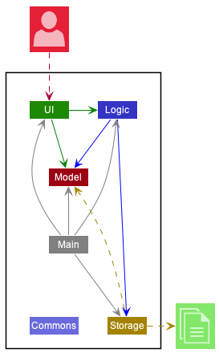

**Main components of the architecture**

Given below is a quick overview of the main components and how they interact with each other.

**`Main`** has two classes called [`Main`](https://github.com/AY2122S1-CS2103T-T11-2/tp/blob/master/src/main/java/lingogo/Main.java)
and [`MainApp`](https://github.com/AY2122S1-CS2103T-T11-2/tp/blob/master/src/main/java/lingogo/MainApp.java).
It has the following responsibilities:
* At app launch: Initializes the components in the correct sequence, and connects them up with each other.
* At shut down: Shuts down the components and invokes cleanup methods where necessary.

[**`Commons`**](#common-classes) represents a collection of classes used by multiple other components.

The rest of the app consists of **four components**.

* [**`UI`**](#ui-component): The UI of the App.
* [**`Logic`**](#logic-component): The command executor.
* [**`Model`**](#model-component): Holds the data of the App in memory.
* [**`Storage`**](#storage-component): Reads data from, and writes data to, the hard disk.

**How the architecture components interact with each other**

The *Sequence Diagram* below shows how the components interact with each other for the scenario where the user issues the command `delete 1`.

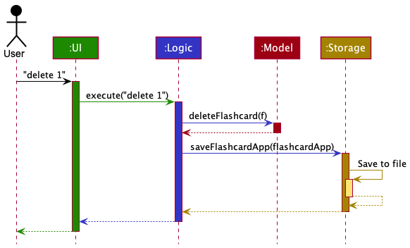

Each of the four main components (also shown in the diagram above):

* Defines its API in an interface with the same name as the component.
* Implements its functionality using a concrete `{Component Name}Manager` class, which follows the corresponding API interface in the previous point.

For example, the `Logic` component defines its API in the `Logic.java` interface and implements its functionality using
the `LogicManager.java` class, which follows the `Logic` interface. Other components interact with a given component
through its interface rather than the concrete class (reason: to prevent outside component's being coupled to the implementation of a component),

We can see an illustration of this in the (partial) *Class Diagram* below.

The sections below give more details on each component.

### UI component

**API** : [`Ui.java`](https://github.com/AY2122S1-CS2103T-T11-2/tp/blob/master/src/main/java/lingogo/ui/Ui.java)

The `UI` component contains the logic for the graphical user interface (GUI) that users see.

An overall *Class Diagram* for this component can be found below:

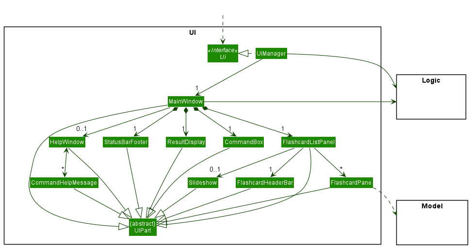

The `UI` component consists of a `MainWindow` that is made up of several sub-components (e.g.`CommandBox`, `ResultDisplay`, `FlashcardListPanel`,
`StatusBarFooter`, etc.) which come together to make up the entire user interface. All these, including the `MainWindow`, inherit from the abstract `UiPart` class which captures
the commonalities between classes that represent parts of the visible GUI.

The `UI` component uses the JavaFx UI framework. The layout of these UI parts are defined in matching `.fxml` files
that are in the `src/main/resources/view` folder. For example, the layout of the
[`MainWindow`](https://github.com/AY2122S1-CS2103T-T11-2/tp/blob/master/src/main/java/lingogo/ui/MainWindow.java)
is specified in [`MainWindow.fxml`](https://github.com/AY2122S1-CS2103T-T11-2/tp/blob/master/src/main/resources/view/MainWindow.fxml)

The `UI` component:

* Executes user commands using the `Logic` component.
* Listens for changes to `Model` data so that the UI can be updated with the modified data.
* Keeps a reference to the `Logic` component, because the `UI` relies on the `Logic` to execute commands.
* Depends on some classes in the `Model` component, as it displays `Flashcard` objects residing in the `Model`.

### Logic component

**API** : [`Logic.java`](https://github.com/AY2122S1-CS2103T-T11-2/tp/blob/master/src/main/java/lingogo/logic/Logic.java)

The `Logic` component is responsible for the overall flow of the commands in LingoGO!, linking `UI`, `Model`, and `Storage` together.

A (partial) *Class Diagram* of the `Logic` component can be found below:

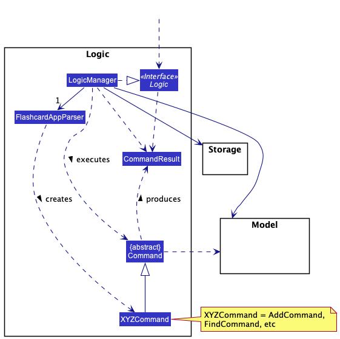

How the `Logic` component works:
1. When `Logic` is called upon to execute a command, it uses the `FlashcardAppParser` class to parse the user command.
1. This creates a `Command` object (more precisely, an object of one of its subclasses e.g., `AddCommand`) which is executed by the `LogicManager`.
1. The command can communicate with the `Model` when it is executed (e.g. to add a flashcard).
1. The result of the command execution is encapsulated in a `CommandResult` object which is returned by `Logic`.

The *Sequence Diagram* below illustrates the interactions within the `Logic` component for the `execute("delete 1")` API call.

:information_source: **Note:** The lifeline for `DeleteCommandParser` should end at the destroy marker (X) but due to a limitation of PlantUML, the lifeline reaches the end of diagram.

Here are the other classes in `Logic` (omitted from the *Class Diagram* above) that are used for parsing a user command:

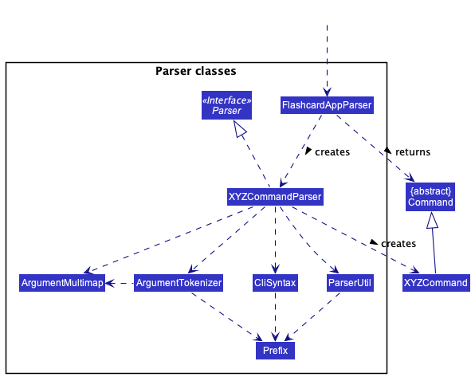

How the parsing works:
* When called upon to parse a user command, the `FlashcardAppParser` class creates an `XYZCommandParser` (`XYZ` is a placeholder for the specific command name e.g., `AddCommandParser`)
* `XYZCommandParser` uses the other classes shown above to parse the user command and create a `XYZCommand` object (e.g., `AddCommand`) which the `FlashcardAppParser` returns back as a `Command` object.
* All `XYZCommandParser` classes (e.g., `AddCommandParser`, `DeleteCommandParser`, ...) inherit from the `Parser` interface so that they can be treated similarly where possible (e.g., during testing).

### Model component

**API** : [`Model.java`](https://github.com/AY2122S1-CS2103T-T11-2/tp/blob/master/src/main/java/lingogo/model/Model.java)

The `Model` component holds the data of LingoGO! in memory while the app is running.

A *Class Diagram* of the `Model` component can be found below:

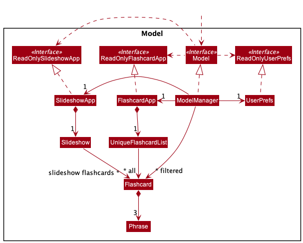

The `Model` component:

* Stores the flashcard app data i.e., all `Flashcard` objects (which are contained in a `UniqueFlashcardList` object).
* Stores the currently 'selected' `Flashcard` objects (e.g., results of a search query) as a **separate filtered list** which is exposed as an unmodifiable `ObservableList<Flashcard>` that can be 'observed' e.g. the `UI` can be bound to this list so that the `UI` automatically updates when the data in the list changes.
* Stores the slideshow app data i.e., all `Flashcard` objects in the slideshow (which are contained in a `Slideshow` object). This is exposed as a `ReadOnlySlideshowApp` object.
* Stores a `UserPref` object that represents the user’s preferences. This is exposed as a `ReadOnlyUserPref` object.
* Does not depend on any of the other three components (as the `Model` represents data entities of the domain, it should make sense on its own without depending on other components).

### Storage component

**API** : [`Storage.java`](https://github.com/AY2122S1-CS2103T-T11-2/tp/blob/master/src/main/java/lingogo/storage/Storage.java)

The `Storage` component stores all of LingoGO!'s data so that it can be saved and retrieved in subsequent runs of the app.

A *Class Diagram* of the `Storage` component can be found below:

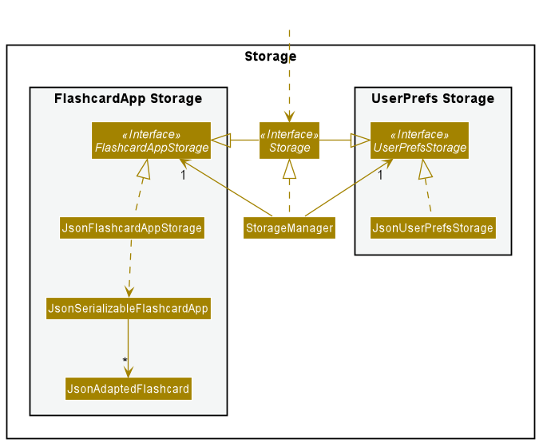

The `Storage` component:
* Can save both address book data and user preference data in JSON format, and read them back into corresponding objects.
* Inherits from both `FlashcardAppStorage` and `UserPrefStorage`, which means it can be treated as either one (if the functionality of only one is needed).
* Depends on some classes in the `Model` component (because the `Storage` component's job is to save/retrieve objects that belong to the `Model`).

### Common classes

Classes used by multiple components are in the `lingogo.commons` package.

--------------------------------------------------------------------------------------------------------------------

## **Feature Implementation**

This section describes some noteworthy details on how certain features are implemented.

### Filter feature

#### Description
The filter feature allows users to quickly select a group of flashcards to be shown in the displayed flashcards list
of the GUI. This effectively enables users to "prepare" a batch of flashcards for a test session. The command
accepts various conditions from the user to filter the flashcards with. (e.g. what type of
language, which card indexes).

#### Implementation

The filter feature is facilitated by `ModelManager`. It extends `Model` and implements `updateFilteredFlashcardList`
which returns an unmodifiable view of filtered flashcards in the GUI.

The filter feature also relies on a nested `FilterBuilder` class within `FilterCommand`. Multiple filters can be
given by the user in one command, however only one predicate (filter) can be accepted by
`Model::updateFilteredFlashList` to produce the filtered flashcards. `FilterBuilder` helps by combining multiple
predicates into a single predicate.

`FilterBuilder` is also a mutable class which allows processed user inputs to be directly set as variables within a
`FilterBuilder` instance. A mutable design is acceptable for `FilterBuilder` since it only has a one-time usage within
`FilterCommand`. Furthermore, set-variable methods in `FilterBuilder` reduces the need to add unnecessarily
complex constructors or factory methods when more types of filters are added.

The following sequence diagrams shows how the filter operation works:

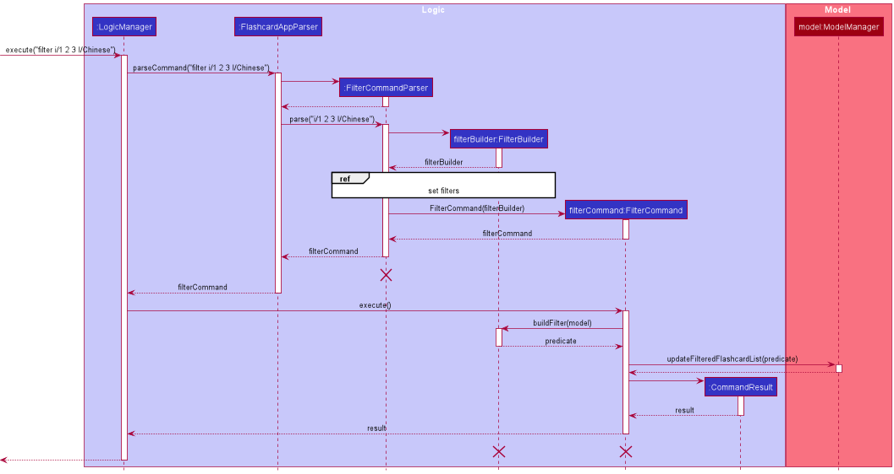

:information_source: **Note:** The lifeline for `FilterCommand`,
`FilterCommandParser` and `FilterBuilder`should end at the destroy marker (X) but due to a limitation of PlantUML,
the lifeline reaches the end of diagram.

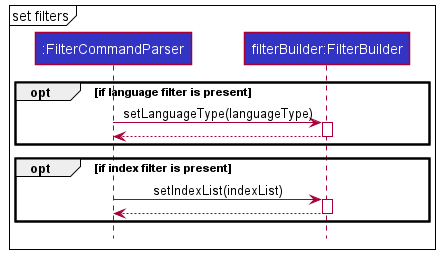

#### Design considerations

**Aspect: Number of filter conditions that users can input per command:**

* **Alternative 1 (current choice):** Accept multiple conditions per command.
  * Pros: More convenient for users, creating a better user experience.
  * Cons: Harder to implement and more difficult to test (due to large permutations of different conditions to
    consider).

* **Alternative 2:** Only accept one condition per command.
  * Pros: Easier to implement.
  * Cons: Less convenient for users.

**Aspect: Mutability of `FilterBuilder`**

* **Alternative 1 (current choice):** Make it mutable.
    * Pros: No need for complex constructors and easier for more types of filters to be added in the future.
    * Cons: Less defensive code and easier for bugs to arise due to programmer error.

* **Alternative 2:** Make it immutable.
    * Pros: More defensive code.
    * Cons: There is a need for multiple constructors to handle optional user inputs due to a lack of set-variable
      methods. Furthermore `FilterCommandParser` may become needlessly complex.

### Export feature

#### Implementation

The export feature is facilitated by `ModelManager`. It extends `Model` and implements `exportFlashcards`
which creates a CSV file in the `data` folder.

The export feature uses `CSVWriter` class which generates a CSV file
line by line in the file specified by the user.

The following activity diagram summarizes what happens when a user executes a new command:

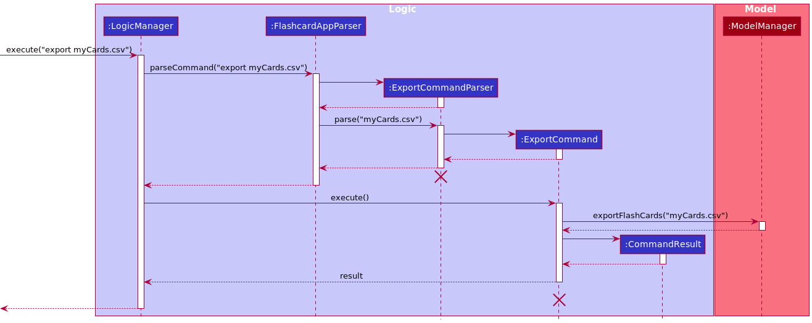

### Import feature

#### Implementation

The import feature is facilitated by `ModelManager`. It extends `Model` and implements `importFlashcards`
which returns an updated view of the flashcards in the GUI.

The import feature uses `CSVReader` class to check if the given CSV file
is in the correct format line by line and uploads each card to the flashcard list
if there is no duplicate.

The following activity diagram summarizes what happens when a user executes a new command:

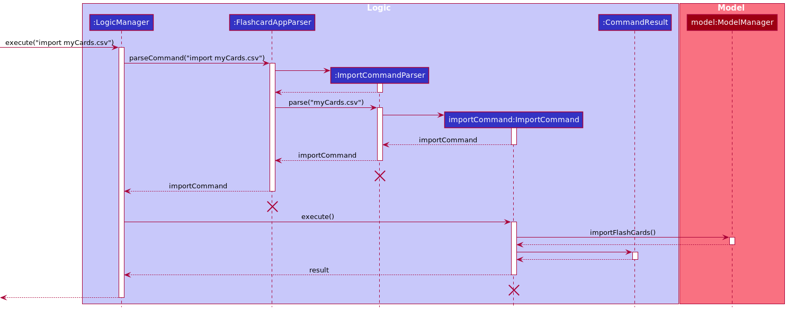

### Find feature

#### Implementation

The find feature is facilitated by `ModelManager`. It extends `Model` implements `updateFilteredFlashcardList` which returns an unmodifiable view of flashcards matching the specified keywords in the GUI.

The find feature relies on the `FindCommandParser` and `PhraseContainsKeywordsPredicate`. Multiple keywords can be given for both english and foreign phrases. `FindCommandParser` uses `PhraseContainsKeywordsPredicate` to select flashcards that matches the keywords.

The following activity diagram summarizes what happens when a user executes a new command:

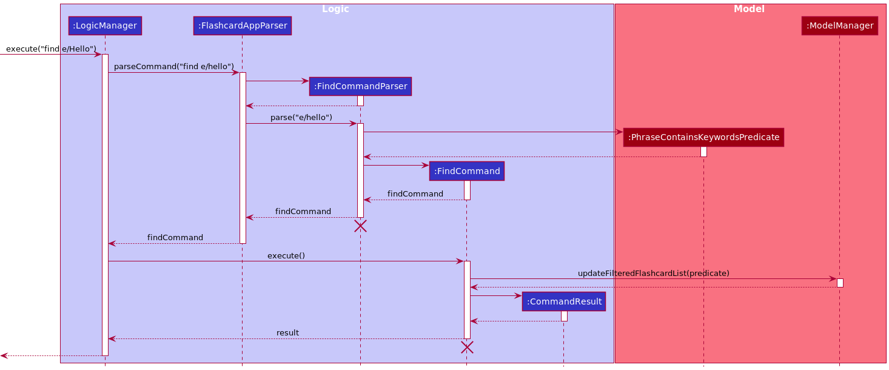

#### Design considerations

**Aspect: How to search in foreign language:**

* **Alternative 1 (current choice):** Allow non-full match
  * Pros: Will not miss out any related flashcards that is related to the keyword provided.
  * Cons: May output a lot more flashcards than the user's desired outcome.

* **Alternative 2:** Only allow full match
  * Pros: Only exact match will be output, user will only see flashcards that are exactly the keyword.
  * Cons: Too restrictive, will not output phrases that contains more than the keyword.

### List feature

#### Implementation

The list feature is facilitated by `ModelManager`. It extends `Model` and implements `updateFilteredFlashcardList` which returns an unmodifiable view of the flashcards in the GUI.

The list feature relies on the `ListCommandParser` and `FlashcardInGivenFlashcardListPredicate`. In order to generate a list of random flashcards, a random stream of `Index` is used to get the flashcards from the main list of flashcards.

The sequence diagram below illustrates the execution of `ListCommand`.

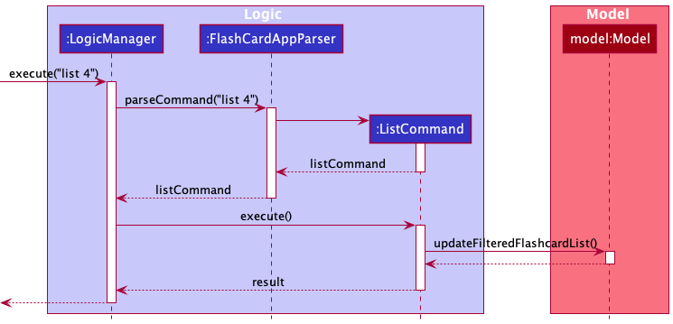

#### Design considerations:

**Aspect: Generating list of flashcards:**

* **Alternative 1 (current choice):** Randomise the list of flashcards
    * Pros: Users are able to use flashcards more effectively.
    * Cons: Harder to implement and needs a random stream of `Index`.

* **Alternative 2:** Output list up to `n`
    * Pros: Easy to implement.
    * Cons: Does not add value to the user's learning experience.

### Slideshow feature

#### Description

The slideshow feature displays the flashcards shown in list mode one at a time in individual "slides".
In slideshow mode, users can test how well they remember their flashcards by entering their answers for each flashcard
and getting feedback on whether they are right or wrong. Users may also navigate between "slides".

#### Implementation

The slideshow feature is facilitated by `ModelManager`.
It extends `Model` and implements `startSlideshow`, `stopSlideshow`, `isSlideshowActive`, `slideshowNextFlashcard`,
`slideshowPreviousFlashcard`, `answerCurrentSlide`, `displayCurrentAnswer`, `getSlideshowApp`, and `getCurrentSlide`.

The above methods in turn facilitate the following commands:
* `SlideshowCommand` - When the user enters slideshow mode.
* `AnswerCommand` - When the user enters an answer for the flashcard shown on the current slide.
* `NextCommand` - When the user navigates to the next slide.
* `PreviousCommand` - When the user navigates to the previous slide.
* `StopCommand` - When the user exits slideshow mode.

The `SlideshowApp` class is used to encapsulate all state and operations related to the slideshow.
It is exposed as a `ReadOnlySlideshowApp` object.

The following sequence diagrams shows how the slideshow command works:

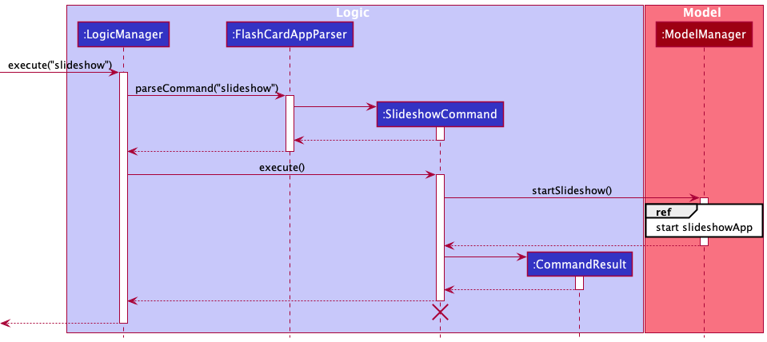

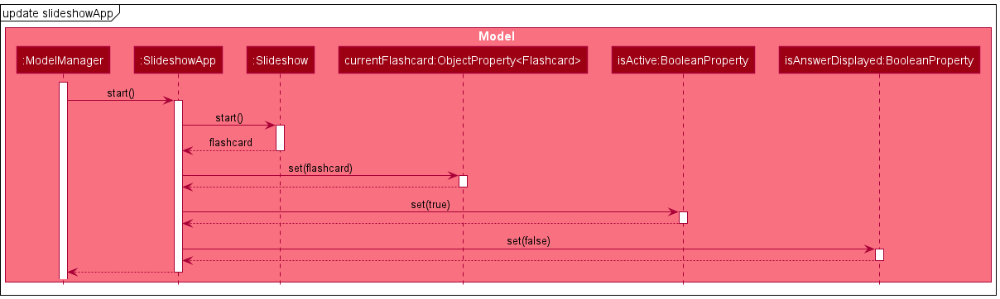

The reference sequence diagram above shows the various state changes within `SlideshowApp`.
When a certain property is changed, the UI updates itself accordingly.
The relevant `UiPart` listens to changes in these properties using the `ChangeListener` class provided by `java.beans`.

For instance, when `isActive:BooleanProperty` becomes true, the UI will go into slideshow mode.
Below is a code snippet on how this is implemented in `FlashcardListPanel.java`.

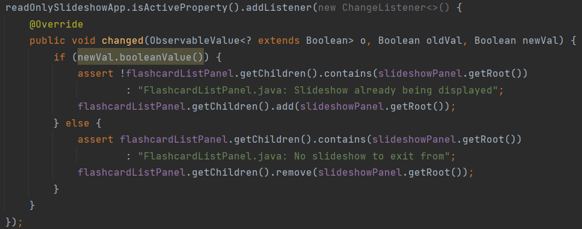

--------------------------------------------------------------------------------------------------------------------

## **Documentation, logging, testing, configuration, dev-ops**

* [Documentation guide](Documentation.md)
* [Testing guide](Testing.md)
* [Logging guide](Logging.md)
* [Configuration guide](Configuration.md)
* [DevOps guide](DevOps.md)

--------------------------------------------------------------------------------------------------------------------

## **Appendix A: Product Scope**

### Target user profile

University students
* Whose first language is English
* Who are learning a new language

### Value proposition

* Fast way to generate flashcards to learn new languages.
* Help students memorise words when learning a new language.
* Gamified features such as recording of scores and tracking of improvements to make learning engaging and encourage continued usage.

--------------------------------------------------------------------------------------------------------------------

## **Appendix B: User Stories**

**Categories:** Usage pattern, user behaviours, general user, multiple language user, user learning style, user learning 'rate', level of experience, user collaboration 
**Priorities:** High (must have) - `* * *`, Medium (nice to have) - `* *`, Low (unlikely to have) - `*`

| Priority | Category | As a/an... | I want to... | So that I...
| -------- | -------- | ---------- | ------------ | ----------------
|***| Level of experience | new user | be guided through the set-up process of a flashcard | can use LingoGo! Properly
|***| General user | user | be able to add new flash cards |
|***| General user | user | be able to delete my flashcards |
|***| General user | user | be able to list my flashcards |
|***| General user | user | be able to test myself and view my performance using flashcards |
|***| General user | user | be able to update my flashcards |
|***| User behaviours | lazy user | automatically generate cards by typing in the vocabulary | don't have to spend time manually creating cards
|**| Level of experience | experienced user | be able to delete multiple flashcards that are no longer relevant to me (multi-delete function) |
|**| Level of experience | new user | have a basic set of flashcards available from the get go | can reduce the setup time or reduce the need for setup
|**| Multiple language user | user who is learning multiple languages | be able to combine flashcards of the same question in different languages | can test myself in all the languages that I have learnt in one go
|**| Usage patterns | frequent user | be able to jumble up my flashcards | am really testing my vocabulary instead of just memorising without really knowing the vocabulary
|**| User collaboration | helpful user | be able to export and share my flashcards with my friends | can help them save time in generating their own set of flashcards (and they can help me too!)
|*| General user | user | be able to tag my flashcards under the categories I specify (e.g. easy, medium, for fun, nouns, etc.) | organise my flashcards easily
|*| General user | user | see the summary statistics over a period of time | can track my progress
|*| General user | user | use the app in another language |
|*| Level of experience | expert user | be able to set up questions in batches | can prepare flashcards faster
|*| Level of experience | long-time user | be able to archive my flashcards that I may not have used for a long time | can retrieve them in future should I want to use them
|*| Level of experience | long-time user | be able to delete flashcards that have not been used for over a year | only have the flashcards that are relevant to me
|*| Level of experience | long-time user | be able to quickly search through my large library of cards easily and quickly |
|*| Level of experience | new user | have intuitive UI and commands | can get started easily
|*| Multiple language user | user who is learning multiple languages | be able to load different question sets and store my questions in different files |
|*| Usage patterns | active user with hundred of cards already made | be automatically given a list of cards to test my memory | can efficiently expand my vocabulary
|*| Usage patterns | forgetful user (who forgets about LingoGO!) | be reminded about using flashcards | can be actively learning new vocabularies instead of just cramming them at the last minute
|*| Usage patterns | frequent user | be able to load up cards done x days ago | can test my memory retention of the words I learned that day
|*| User behaviours | mobile user | be able to access my cards wherever I am, on the go |
|*| User behaviours | organised user (who prepares flashcards based on languages) | I want to be able to combine different decks of flashcards | can prepare for my major exams (eg. mid-terms, finals)
|*| User behaviours | user who learns better when things are in hardcopy | have a convenient way to print out the flashcards | do not have to manually format the card design
|*| User behaviours | user who seeks improvement | see the progress made in terms of scores | can visualize my improvement
|*| User collaboration | competitive user | be able to compete with my friends based on how fast and how mnay flashcards we can get correct | will be more motivated to learn
|*| User learning 'rate' | slow/fast learner | adjust the frequency at which the cards will be tested | can better suit my pace of learning
|*| User learning 'rate' | slow learner | have cards with words I don't remember to be shown more often to reinforce my learning |
|*| User learning style | auditory user | hear the vocabulary that I stored in the flashcard | can better memorize the words by sound
|*| User learning style | visual learner | color code my flashcards | can better memorize the words by category
|*| User learning style | visual learner | use pictures instead of words as the question part of my flashcard | can remember the vocabulary easier

--------------------------------------------------------------------------------------------------------------------

## **Appendix C: Use Cases**

(For all use cases below, the **System** is `LingoGO!` and the **Actor** is the `user`, unless specified otherwise)

### Use case: List all flashcards

**MSS**
1. User requests to list out all flashcards.
2. LingoGO! shows a list of all the flashcards.

   Use case ends.

### Use case: List n flashcards

**MSS**
1. User requests to list out n number of flashcards.
2. LingoGO! randomly selects n number of flashcards to be shown in the list of flashcards.

   Use case ends.

**Extensions**
* 1a. The given user input is invalid (e.g. `list abc` or `list -1`)
    * 1a1. LingoGO! shows an error message.

      Use case resumes at step 1.

* 1b. The given user input is larger than the total flashcards
    * 1b1. LingoGO! shows an error message.

      Use case resumes at step 1.

### Use case: Add a flashcard

**Guarantees**
* A flashcard is added only if all of its information is provided.

**MSS**
1. User requests to add a new flashcard.
2. User provides information regarding the flashcard they want to add.
3. LingoGO! creates and adds a new flashcard.

   Use case ends.

**Extensions**
* 2a. Flashcard that the user wants to add is a duplicate of a flashcard already present in LingoGO!
    * 2a1. LingoGO! shows an error message.

      Use case resumes at step 1.

* 2b. Information provided by the user in incomplete.
    * 2b1. LingoGO! shows an error message.

      Use case resumes at step 1.

### Delete a flashcard

**MSS**
1. User requests to list out all flashcards.
2. LingoGO! shows a list of flashcards.
3. User requests to delete a specific flashcard from the list.
4. LingoGO! deletes the flashcard.

   Use case ends.

**Extensions**
* 2a. The list is empty.

  Use case ends.

* 3a. The given index is invalid.
    * 3a1. LingoGO! shows an error message.

      Use case resumes at step 2.

### Edit a flashcard

**Guarantees**
* A flashcard will be edited only if the edited information provided is valid.

**MSS**
1.  User requests to list out all flashcards.
2.  LingoGO! shows a list of flashcards.
3.  User requests to edit a specific flashcard from the list.
4.  User provides the updated information for the flashcard.
5.  LingoGO! updates the flashcard with the information.

    Use case ends.

**Extensions**
* 2a. The list is empty.

  Use case ends.

* 3a. The given index is invalid.
    * 3a1. LingoGO! shows an error message.

      Use case resumes at step 2.

* 4a. The user does not provide any information.
    * 4a1. LingoGO! shows an error message.

      Use case resumes at step 2.

* 4b. The user provides information that causes the flashcard to become a duplicate of another flashcard in LingoGO!
    * 4b1. LingoGO! shows an error message.

      Use case resumes at step 2.

### Find a flashcard

**MSS**
1. User requests to find a flashcard based on its English or Foreign value.
2. LingoGO! shows a list of flashcards that contains the keyword given by the user.

   Use case ends.

**Extensions**
* 1a. The given user input is invalid.
    * 1a1. LingoGO! shows an error message.

      Use case resumes at step 1.

### Import flashcards

**Guarantees**
* Flashcards will only be imported if the information provided is complete.

**MSS**
1. User creates a file containing information about flashcard questions and their corresponding answers.
2. User requests to import the information in the file into LingoGO!
3. LingoGO! creates and adds new flashcards to the current list of flashcards according to the information provided
   in the file.

   Use case ends.

**Extensions**
* 2a. Information provided in the file is incomplete.
    * 2a1. LingoGO! shows an error message.
    * 2a2. User checks and edits the file to fill in any missing information.

      Steps 2a1-2a2 are repeated until the data in the file is complete.

      Use case resumes from step 3.

* 2b. One or more flashcards in the file are duplicates of flashcards currently in LingoGO!
    * 2b1. LingoGO! shows a warning message.

      Use case resumes from step 3, with LingoGO! skipping the creation and addition of the duplicate flashcards.

### Export flashcards

**MSS**
1. User requests to export all flashcards.
2. LingoGO! creates a file containing all information on each flashcard.

   Use case ends.

**Extensions**
* 1a. There are no flashcards present.
    * 1a1. LingoGO! shows a warning message.

      Use case ends.

* 1b. The file name and file path is not specified.
    * 1b1. LingoGO! creates a file with a default name in a default directory that will contain all information on each
      flashcard.

      Use case ends.

### Getting help

**MSS**
1. User requests for help.
2. LingoGO! shows user a help message.

   Use case ends.

--------------------------------------------------------------------------------------------------------------------

## **Appendix D: Non-Functional Requirements**

1. Should work on any _mainstream OS_ as long as it has Java `11` or above installed.
2. Should be able to hold up to 1000 flashcards without a noticeable sluggishness in performance for typical usage.
3. A user with above average typing speed for regular English text (i.e. not code, not system admin commands) should be able to accomplish most of the tasks faster using commands than using the mouse.
4. Should be usable to someone who has never used flashcards before.

--------------------------------------------------------------------------------------------------------------------

## **Appendix E: Glossary**

* **Mainstream OS**: Windows, Linux, Unix, OS-X
* **Flashcard**: A memory aid that users can use to input a phrase or word in the language that they are learning
  along with a hidden translation

--------------------------------------------------------------------------------------------------------------------

# **Appendix F: Instructions for Manual Testing**

Given below are instructions to test the app manually.

:information_source: **Note:** These instructions only provide a starting point for testers to work on;
testers are expected to do more *exploratory* testing.

### Launch and Shutdown

1. Initial launch

   1. Download the jar file and copy into an empty folder.

   2. Double-click the jar file  
       Expected: Shows the GUI with a set of sample flashcards. The window size may not be optimum.

1. Saving window preferences

   1. Resize the window to an optimum size. Move the window to a different location. Close the window.

   1. Re-launch the app by double-clicking the jar file 
       Expected: The most recent window size and location is retained.

### Deleting a Flashcard

1. Deleting a flashcard while all flashcards are listed

   1. Prerequisites: List all flashcards using the `list` command. Multiple flashcards are in the list.

   1. Test case: `delete 1` 
      Expected: First flashcard is deleted from the list. Details of the deleted flashcard (e.g. Language type, English Phrase, Foreign Phrase) shown in the command result. Command box will be cleared.

   1. Test case: `delete 0` 
      Expected: No flashcard is deleted. Error details (e.g. Error type and Message Usage) shown in the command result. The `delete 0` command will remain in the command box.

   1. Other incorrect delete commands to try: `delete`, `delete x`, `...` (where x is larger than the list size) 
      Expected: Similar to previous.

_{ more test cases to be added in future …​ }_

<!---
### Saving data

1. Dealing with missing/corrupted data files

   1. _{explain how to simulate a missing/corrupted file, and the expected behavior}_

1. _{ more test cases …​ }_
-->
