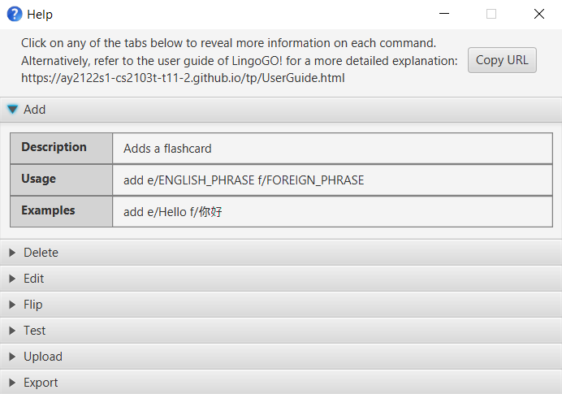

AddressBook Level 3 (AB3) is a **desktop app for managing contacts, optimized for use via a Command Line Interface** (CLI) while still having the benefits of a Graphical User Interface (GUI). If you can type fast, AB3 can get your contact management tasks done faster than traditional GUI apps.

* Table of Contents
{:toc}

--------------------------------------------------------------------------------------------------------------------

## Quick start

1. Ensure you have Java `11` or above installed in your Computer.

1. Download the latest `addressbook.jar` from [here](https://github.com/se-edu/addressbook-level3/releases).

1. Copy the file to the folder you want to use as the _home folder_ for your AddressBook.

1. Double-click the file to start the app. The GUI similar to the below should appear in a few seconds. Note how the app contains some sample data. 
   

1. Type the command in the command box and press Enter to execute it. e.g. typing **`help`** and pressing Enter will open the help window. 
   Some example commands you can try:

   * **`list`** : Lists all contacts.

   * **`add`**`e/Good Morning f/早安` : Adds a flashcard with English phrase `Good Morning` and corresponding foreign phrase `早安` to LingoGO!.

   * **`delete`**`3` : Deletes the 3rd flashcard shown in the current list.

   * **`clear`** : Deletes all contacts.

   * **`exit`** : Exits the app.

1. Refer to the [Features](#features) below for details of each command.

--------------------------------------------------------------------------------------------------------------------

## Features

**:information_source: Notes about the command format:** 

* Words in `UPPER_CASE` are the parameters to be supplied by the user. 
  e.g. in `add e/ENGLISH_PHRASE f/FOREIGN_PHRASE`, `ENGLISH_PHRASE` and `FOREIGN_PHRASE` are parameters which can be used as `add e/Good Morning f/早安`.

* Items in square brackets are optional. 
  e.g `n/NAME [t/TAG]` can be used as `n/John Doe t/friend` or as `n/John Doe`.

* Items with `…`​ after them can be used multiple times including zero times. 
  e.g. `[t/TAG]…​` can be used as ` ` (i.e. 0 times), `t/friend`, `t/friend t/family` etc.

* Parameters can be in any order. 
  e.g. if the command specifies `n/NAME p/PHONE_NUMBER`, `p/PHONE_NUMBER n/NAME` is also acceptable.

* If a parameter is expected only once in the command but you specified it multiple times, only the last occurrence of the parameter will be taken. 
  e.g. if you specify `p/12341234 p/56785678`, only `p/56785678` will be taken.

* Extraneous parameters for commands that do not take in parameters (such as `help`, `list`, `exit` and `clear`) will be ignored. 
  e.g. if the command specifies `help 123`, it will be interpreted as `help`.

### Viewing help : `help`

Shows a message explaning how to access the help page.

Format: `help`

### Adding a flashcard: `add`

Adds a flashcard to LingoGO!.

Format: `add e/ENGLISH_PHRASE f/FOREIGN_PHRASE`

Examples:
* `add e/Good Morning f/早安`
* `add e/Hello f/你好`

### Listing all persons : `list`

Shows a list of all persons in the address book.

Format: `list`

### Editing a person : `edit`

Edits an existing person in the address book.

Format: `edit INDEX [n/NAME] [p/PHONE] [e/EMAIL] [a/ADDRESS] [t/TAG]…​`

* Edits the person at the specified `INDEX`. The index refers to the index number shown in the displayed person list. The index **must be a positive integer** 1, 2, 3, …​
* At least one of the optional fields must be provided.
* Existing values will be updated to the input values.
* When editing tags, the existing tags of the person will be removed i.e adding of tags is not cumulative.
* You can remove all the person’s tags by typing `t/` without
    specifying any tags after it.

Examples:
*  `edit 1 p/91234567 e/johndoe@example.com` Edits the phone number and email address of the 1st person to be `91234567` and `johndoe@example.com` respectively.
*  `edit 2 n/Betsy Crower t/` Edits the name of the 2nd person to be `Betsy Crower` and clears all existing tags.

### Locating persons by name: `find`

Finds persons whose names contain any of the given keywords.

Format: `find KEYWORD [MORE_KEYWORDS]`

* The search is case-insensitive. e.g `hans` will match `Hans`
* The order of the keywords does not matter. e.g. `Hans Bo` will match `Bo Hans`
* Only the name is searched.
* Only full words will be matched e.g. `Han` will not match `Hans`
* Persons matching at least one keyword will be returned (i.e. `OR` search).
  e.g. `Hans Bo` will return `Hans Gruber`, `Bo Yang`

Examples:
* `find John` returns `john` and `John Doe`
* `find alex david` returns `Alex Yeoh`, `David Li` 
  

### Deleting a flashcard : `delete`

Deletes the specified flashcard from LingoGO!.

Format: `delete INDEX`

* Deletes the flashcard at the specified `INDEX`.
* The index refers to the index number shown in the displayed flashcard list.
* The index **must be a positive integer** 1, 2, 3, …​

Examples:
* `list` followed by `delete 2` deletes the 2nd flashcard in LingoGO!.
* `find Hello` followed by `delete 1` deletes the 1st flashcard in the results of the `find` command.

### Clearing all entries : `clear`

Clears all entries from the address book.

Format: `clear`

### Exiting the program : `exit`

Exits the program.

Format: `exit`

### Saving the data

AddressBook data are saved in the hard disk automatically after any command that changes the data. There is no need to save manually.

### Editing the data file

AddressBook data are saved as a JSON file `[JAR file location]/data/addressbook.json`. Advanced users are welcome to update data directly by editing that data file.

:exclamation: **Caution:**
If your changes to the data file makes its format invalid, AddressBook will discard all data and start with an empty data file at the next run.

### Archiving data files `[coming in v2.0]`

_Details coming soon ..._

--------------------------------------------------------------------------------------------------------------------

## FAQ

**Q**: How do I transfer my data to another Computer? 
**A**: Install the app in the other computer and overwrite the empty data file it creates with the file that contains the data of your previous AddressBook home folder.

--------------------------------------------------------------------------------------------------------------------

## Command summary

Action | Format, Examples
--------|------------------
**Add** | `add e/ENGLISH_PHRASE f/FOREIGN_PHRASE`   e.g., `add e/Good Morning f/早安`
**Clear** | `clear`
**Delete** | `delete INDEX`  e.g., `delete 3`
**Edit** | `edit INDEX [n/NAME] [p/PHONE_NUMBER] [e/EMAIL] [a/ADDRESS] [t/TAG]…​`  e.g.,`edit 2 n/James Lee e/jameslee@example.com`
**Find** | `find KEYWORD [MORE_KEYWORDS]`  e.g., `find James Jake`
**List** | `list`
**Help** | `help`

--------------------------------------------------------------------------------------------------------------------

## Appendix: Requirements

### Product Scope

#### Target user profile:
* Uni students who are learning a new language

#### Value proposition
* Fast way to generate flashcards to learn new languages
* Help students memorise words when learning a new language
* Gamified features such as recording of scores and tracking of improvements to make learning engaging and encourage continued usage

#### User stories
Categories: Usage pattern, user behaviours, general user, multiple language user, user learning style, user learning 'rate', level of experience, user collaboration

Category | As a/an... | I want to... | So that I...
-------- | ---------- | ------------ | ----------------
Usage patterns | active user with hundred of cards already made | be automatically given a list of cards to test my memory | can efficiently expand my vocabulary
Usage patterns | frequent user | be able to jumble up my flashcards | am really testing my vocabulary instead of just memorising without really knowing the vocabulary
Usage patterns | forgetful user (who forgets about LingoGO!) | be reminded about using flashcards | can be actively learning new vocabularies instead of just cramming them at the last minute
Usage patterns | frequent user | be able to load up cards done x days ago | can test my memory retention of the words I learned that day
User behaviours | lazy user | automatically generate cards by typing in the vocabulary | don't have to spend time manually creating cards
User behaviours | user who seeks improvement | see the progress made in terms of scores | can visualize my improvement
User behaviours | organised user (who prepares flashcards based on languages) | I want to be able to combine different decks of flashcards | can prepare for my major exams (eg. mid-terms, finals)
User behaviours | mobile user | be able to access my cards wherever I am, on the go | 
User behaviours | user who learns better when things are in hardcopy | have a convenient way to print out the flashcards | do not have to manually format the card design
General user | user | use the app in another language | 
General user | user | see the summary statistics over a period of time | can track my progress
General user | user | be able to tag my flashcards under the categories I specify (e.g. easy, medium, for fun, nouns, etc.) | organise my flashcards easily
General user | user | be able to add new flash cards |  
General user | user | be able to list my flashcards | 
General user | user | be able to test myself and view my performance using flashcards | 
General user | user | be able to delete my flashcards | 
General user | user | be able to update my flashcards | 
Multiple language user | user who is learning multiple languages | be able to load different question sets and store my questions in different files | 
Multiple language user | user who is learning multiple languages | be able to combine flashcards of the same question in different languages | can test myself in all the languages that I have learnt in one go
User learning style | auditory user | hear the vocabulary that I stored in the flashcard | can better memorize the words by sound
User learning style | visual learner | use pictures instead of words as the question part of my flashcard | can remember the vocabulary easier
User learning style | visual learner | color code my flashcards | can better memorize the words by category
User learning 'rate' | slow/fast learner | adjust the frequency at which the cards will be tested | can better suit my pace of learning
User learning 'rate' | slow learner | have cards with words I don't remember to be shown more often to reinforce my learning | 
Level of experience | long-time user | be able to delete flashcards that have not been used for over a year | only have the flashcards that are relevant to me
Level of experience | new user | be guided through the set-up process of a flashcard | can use LingoGo! Properly
Level of experience | new user | have intuitive UI and commands | can get started easily
Level of experience | new user | have a basic set of questions available from the get go | can reduce the setup time or reduce the need for setup
Level of experience | long-time user | be able to archive my flashcards that I may not have used for a long time | can retrieve them in future should I want to use them
Level of experience | long-time user | be able to quickly search through my large library of cards easily and quickly | 
Level of experience | expert user | be able to set up questions in batches | can prepare flashcards faster
Level of experience | experienced user | be able to delete multiple flashcards that are no longer relevant to me (multi-delete function) | 
User collaboration | helpful user | be able to export and share my flashcards with my friends | can help them save time in generating their own set of flashcards (and they can help me too!)
User collaboration | competitive user | be able to compete with my friends based on how fast and how mnay flashcards we can get correct | will be more motivated to learn
