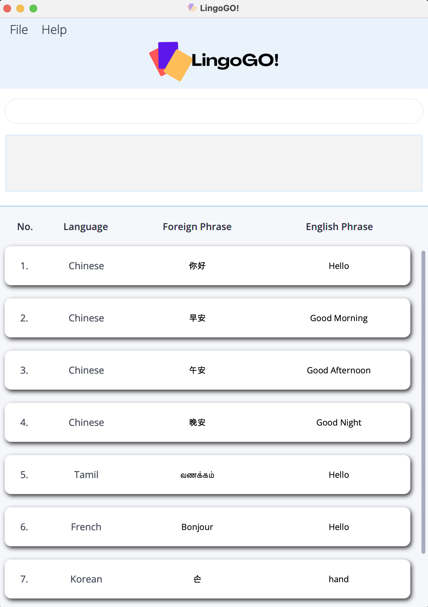
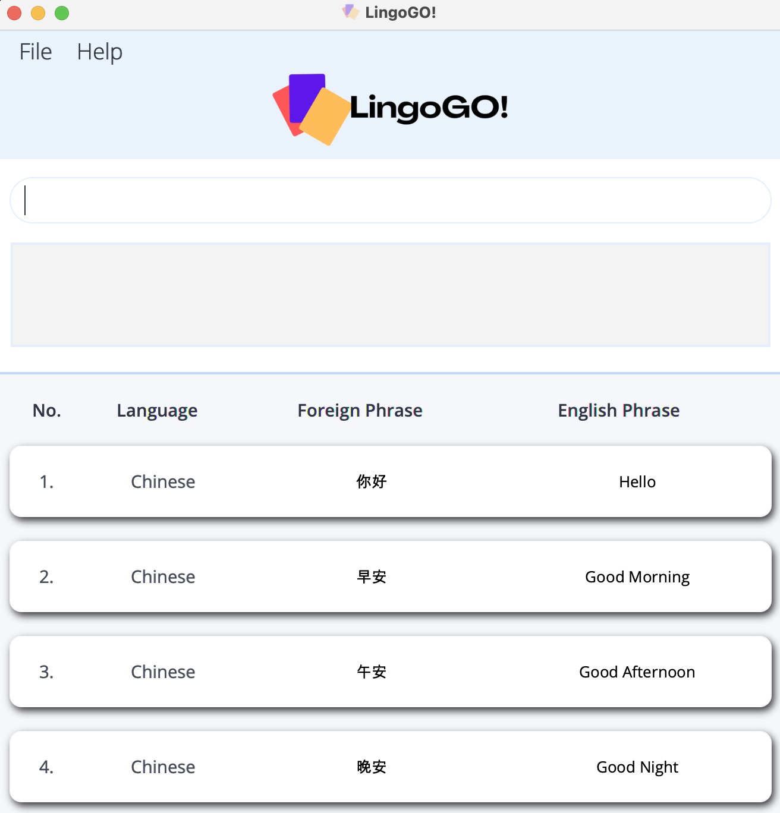
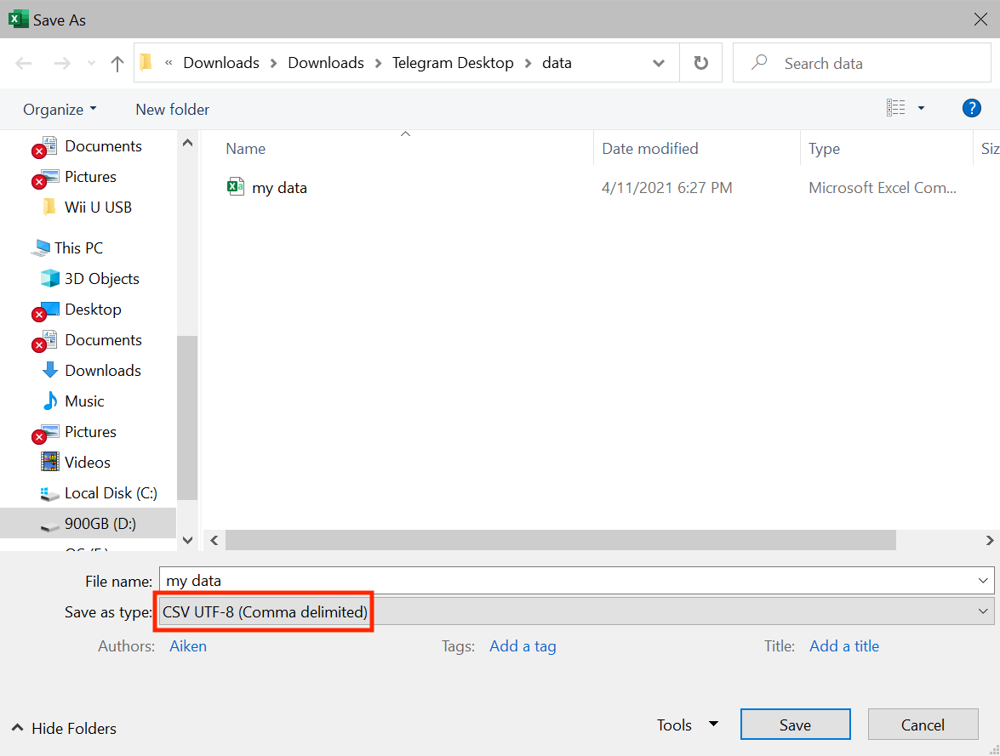

 

LingoGO! is a **desktop app** for **university students who use English as their first language** and are trying to **learn a
new language**. Founded on the widely established learning technique of **spaced-repetition**, LingoGO! takes all the
benefits of pen-and-paper flashcards in learning, and brings them to the next level with our **powerful search** and 
**sharing
features** -- *without the hassle* of managing actual physical ones. Coupled with our unique **Command Line Interface (CLI)** and
an elegant **Graphical User Interface (GUI)** to accompany it, LingoGO! is sure to delight you, and empower you on your
journey in mastering the new language you *have always wanted*.

LingoGO! currently supports **all languages that can be represented on your computer** and has the following main features:
* Addition, deletion, and editing of flashcards.
* Finding and filtering of flashcards by keywords and conditions.
* Importing and exporting of flashcards to be shared with others.
* Testing your knowledge in a questionnaire of flashcards.

Detailed information about these features can be found under the [Modes](#modes) and [Commands](#commands) sections in this user guide.

<h2 id="table-of-contents">Table of Contents</h2>

* Table of Contents
{:toc}

## Purpose of the user guide
This user guide aims to familiarize you with the commands of LingoGO! and to use the application effectively.

--------------------------------------------------------------------------------------------------------------------

## How to use the user guide
* A [Table of Contents](#table-of-contents) with clickable links can be found above to help with navigating across the user guide quickly.
* New users can refer to the [Quick Start](#quick-start) guide for a quick set-up tutorial.
* New users can also refer to [Modes](#modes) to start understanding how to use LingoGO!.
* A detailed outline of the commands can be found under [Commands](#commands).
* Experienced users can refer to the [Command Summary](#command-summary) for a quick overview of all the commands in LingoGO!.
* A [Glossary](#glossary) is provided to help explain certain important terms used in this guide.

--------------------------------------------------------------------------------------------------------------------

## Quick start

1. Ensure you have **Java 11 or above installed** in your Computer (you may download Java from [here](https://www.oracle.com/java/technologies/downloads/)).

1. Download the latest *lingogo.jar* from [here](https://github.com/AY2122S1-CS2103T-T11-2/tp/releases).

1. Copy the file to the folder you want to use as the [home folder](#home-folder) for LingoGO!.

1. Double-click the file to start the app. Upon opening the app, you will be greeted with a welcome message. After acknowledging,
you will see the following [GUI](#gui) with some sample flashcards.

   

    Below is an overview of the [GUI](#gui), with the corresponding number label:
   1. <u>Menu</u>
     * A clickable menu bar.
   1. <u>Command box</u>
      * Type a command into the command box and press Enter to execute it.
      * Some example commands you can try (refer to the [Commands](#commands) section below for a full list of commands and their details):
        * `list` : Lists all flashcards.
        * `add l/Chinese e/Good Morning f/早安` : Adds a flashcard with the `Chinese` language, English phrase `Good Morning`, and corresponding foreign phrase `早安`.
        * `delete 3` : Deletes the 3rd flashcard shown in the displayed flashcard list of [List mode](#list-mode).
        * `find e/Good Morning` : Finds flashcard(s) with the matching English phrase `Good Morning`.
        * `filter l/Chinese` : Shows only the flashcard(s) with the `Chinese` language in the displayed flashcard list of [List mode](#list-mode).
   1. <u>Command result</u>
     * Shows a message after you execute a command.
   1. <u>Displayed flashcard list</u>
     * Shows a list of your flashcards.

--------------------------------------------------------------------------------------------------------------------

## Modes

Before diving into the specific commands, let's have an overview of the different modes in LingoGO!.

LingoGO! has two main modes, [List mode](#list-mode) and [Slideshow mode](#slideshow-mode), through which you can interact with
the application. List mode provides an intuitive table overview to manage flashcards with our 
powerful and flexible search features. In contrast, Slideshow mode allows you to test your knowledge on selected 
flashcards one by one in a questionnaire-style interface while retaining the look and feel of traditional flashcards.

The following two sections will describe these modes in further detail.

### List mode

Below is an example of what LingoGO! looks like in List mode.

LingoGO! always starts in List mode and displays all of your flashcards.

List mode lets you [`add`](#adding-a-flashcard-add), [`delete`](#deleting-a-flashcard-delete),
[`edit`](#editing-a-flashcard-edit), [`import`](#importing-flashcards-import), and [`export`](#exporting-flashcards-export)
flashcards.

Sometimes, you may also want to search for specific flashcards among all your saved flashcards. List mode allows you to 
do this easily using the [`list`](#listing-flashcards-list), [`filter`](#filtering-flashcards-by-conditions-filter),
and [`find`](#locating-flashcards-by-keywords-find) commands.

The [`list`](#listing-flashcards-list), [`filter`](#filtering-flashcards-by-conditions-filter),
and [`find`](#locating-flashcards-by-keywords-find) commands also serve as the means to select which flashcards to 
display. This is useful for your practice sessions as the displayed flashcards will be the 
flashcards you get tested on when you switch to [Slideshow mode](#slideshow-mode).

### Slideshow mode

Below is an example of what LingoGO! looks like in Slideshow mode.

Once you have selected your flashcards using the [`list`](#listing-flashcards-list), [`filter`](#filtering-flashcards-by-conditions-filter), or
[`find`](#locating-flashcards-by-keywords-find) commands in [List mode](#list-mode), you may proceed to test your 
knowledge with them by entering Slideshow mode.

Slideshow mode brings the most out of your practice session by allowing you to focus on one
flashcard at a time and displays the relevant foreign phrase.

To enter Slideshow mode, use the [`slideshow`](#testing-with-a-set-of-flashcards-slideshow) command. 

In Slideshow mode, you can:
* Move to [`next`](#moving-to-the-next-flashcard-in-slideshow-mode-next) or
  [`previous`](#moving-to-the-previous-flashcard-in-slideshow-mode-previous) flashcards.
* Enter an [`answer`](#answering-a-flashcard-answer) for a flashcard.

Once you are done practicing, you may exit Slideshow mode using the [`stop`](#exiting-slideshow-mode-stop) command.

**:information_source: A note about Slideshow mode:** 

* If your flashcards have phrases that are too long to be displayed, you can **increase the app's window size**.

## Commands

The following section gives an in-depth overview of each command in LingoGO! and provides some examples on 
their usages. If you are a new user, you may also want to refer to the [Command format](#command-format) and 
[Flashcard format](#flashcard-format) sections below for a breakdown on LingoGO!'s command and flashcard formats.

### Command format
This section aims to provide you with a quick breakdown on LingoGO!'s command format.

* **Command Words**
  * Each command always starts with a command word such as `add` or `find`.
  * Command words are case-sensitive.
    * e.g. `clEar` will not be accepted for the `clear` command.
  * Along with command words, commands may come with extra details that need to be filled up. 
    * e.g. `clear` is an example of a command used with just the command word alone. 
    * e.g. `add l/LANGUAGE e/ENGLISH_PHRASE f/FOREIGN_PHRASE` is an example of a command that comes with details 
      that need to be provided by you.
* **Prefixes**
  * Certain prefixes have been reserved for use by LingoGO!'s commands. Prefixes are used by LingoGO! to identify your inputs. 
    * e.g. LingoGO! will interpret `l/Tamil` as a Language called `Tamil`.
  * All command prefixes and the inputs they identify are as listed below:
    * `e/` for English Phrase.
    * `f/` for Foreign Phrase.
    * `i/` for Index/Indices.
    * `l/` for Language.
    * `r/` for Index Range.
  * Prefixes are case-sensitive.
    * e.g. `E/` will not be accepted for `e/`.
  * If there are repeated prefixes in a command, only the last occurrence will be taken.
    * e.g. `edit 2 e/Hi e/Hello` is the same as `edit 2 e/Hello`.
  * Prefixes (along with their respective parameters) can be given in any order.
      * e.g. if the command specifies `add l/LANGUAGE e/ENGLISH_PHRASE f/FOREIGN_PHRASE`, `add f/FOREIGN_PHRASE l/LANGUAGE e/ENGLISH_PHRASE` is also acceptable.
* **Parameters**
  * Words in `UPPER_CASE` are parameters to be supplied by you.
    * e.g. a usage of `add l/LANGUAGE e/ENGLISH_PHRASE f/FOREIGN_PHRASE` could be `add l/Chinese e/Good Morning f/早安`.
  * Some commands have optional parameters which you do not need to give. These optional parameters are 
    indicated within square brackets.
    * e.g. `edit INDEX [l/LANGUAGE] [e/ENGLISH_PHRASE] [f/FOREIGN_PHRASE]` can be used as `edit 1 l/Chinese e/Good Morning f/早安` or `edit 1 e/Good Morning`.
  * Extraneous parameters for commands that do not take in parameters (such as `help` and `clear`) will be ignored.
    * e.g. `help 123` is the same as `help`.

### Flashcard format
This section aims to provide you with a quick breakdown on LingoGO!'s flashcard format.

* **`LANGUAGE` parameter**
    * Should not be longer than **50 characters**.
    * Should only contain **alphabetic** characters (e.g. "华文" will not be accepted, since it is not alphabetic).
    * The first letter of each word will be capitalized and the remaining letters will be in lowercase (e.g. "behasa 
      mElayu" will be saved as "Behasa Melayu").
* **`ENGLISH_PHRASE` parameter**
    * Should not be longer than **100 characters**.
    * Is not restricted to alphabetic characters only, but it is **recommended** that you ensure your input is a valid English input (e.g. you can use "こんにちは" as an English input).
* **`FOREIGN_PHRASE` parameter**
    * Should not be longer than **100 characters**.
    * [Slideshow mode](#slideshow-mode) will **only** display the `FOREIGN_PHRASE` of a flashcard. To use the [`answer`](#answering-a-flashcard-answer) command correctly, you need to be able to distinguish between flashcards with the same `FOREIGN_PHRASE`
    but different `ENGLISH_PHRASE`.

**:information_source: A note about flashcards:** 

* LingoGO! **does not allow** you to have **duplicate flashcards** (duplicate flashcards are flashcards containing the same `LANGUAGE`, `ENGLISH_PHRASE`, and `FOREIGN_PHRASE`).

### Adding a flashcard: `add`

Adds a flashcard to LingoGO!.
* This command can only be run in [List mode](#list-mode).
* The flashcard will be added to the bottom of the displayed flashcard list in [List mode](#list-mode).

Format: `add l/LANGUAGE e/ENGLISH_PHRASE f/FOREIGN_PHRASE`

* Adds a new flashcard if all the inputs satisfy the [Flashcard format](#flashcard-format).

Examples:
* `add l/Chinese e/Good Morning f/早安` adds a new flashcard with language, English phrase, and foreign phrase to be `Chinese`, `Good Morning`, `早安` to the bottom of the displayed flashcard list of [List mode](#list-mode).

### Answering a flashcard: `answer`

Checks whether the answer you have provided correctly translates to the foreign phrase displayed in [Slideshow mode](#slideshow-mode).
* This command can only be run in [Slideshow mode](#slideshow-mode).

Format: `answer e/ENGLISH_PHRASE`

* Checks the English phrase of the displayed foreign phrase in [Slideshow mode](#slideshow-mode) against the `ENGLISH_PHRASE` you provide.
* The app will then show the correct English phrase and tell you whether you got it right.
* `ENGLISH_PHRASE` is not case-sensitive (e.g. "HeLLo" matches "hello").
* During a slideshow, you can only answer each flashcard once.

Examples:
* `answer e/hello` checks the English phrase of the foreign phrase on display (e.g. "你好") in [Slideshow mode](#slideshow-mode) to see if `hello` matches it.

### Clearing all flashcards: `clear`

Deletes all flashcards from LingoGO!.
* This command can only be run in [List mode](#list-mode).

Format: `clear`

### Deleting a flashcard: `delete`

Deletes the specified flashcard from LingoGO!.
* This command can only be run in [List mode](#list-mode).

Format: `delete INDEX`

* Deletes the flashcard at the specified `INDEX`.
* `INDEX` refers to the index number of the flashcard shown in [List mode](#list-mode).
* `INDEX` **must be a positive integer** 1, 2, 3, …

Examples:
* `list` followed by `delete 2` lists all flashcard in the app in the displayed flashcard list of [List mode](#list-mode) and deletes the 2nd flashcard.
* `find e/Hello` followed by `delete 1` lists flashcards matching with `ENGLISH_PHRASE` "hello" in the displayed flashcard list of [List mode](#list-mode) and then deletes the 1st flashcard in the displayed flashcard list of [List mode](#list-mode).

### Editing a flashcard: `edit`

Edits an existing flashcard in LingoGO!.
* This command can only be run in [List mode](#list-mode).

Format: `edit INDEX [l/LANGUAGE] [e/ENGLISH_PHRASE] [f/FOREIGN_PHRASE]`

* Edits the flashcard at the specified `INDEX` if all given inputs satisfy the [Flashcard format](#flashcard-format).
* `INDEX` refers to the index number of the flashcard shown in [List mode](#list-mode).
* `INDEX` **must be a positive integer** 1, 2, 3, …​
* **At least one** of the optional fields must be provided.

Examples:
* `edit 1 l/German` edits the language of the 1st flashcard in the displayed flashcard list of [List mode](#list-mode) to be `German`.
* `edit 1 e/Good Morning` edits the English phrase of the 1st flashcard in the displayed flashcard list of [List mode](#list-mode) to be `Good Morning`.
* `edit 2 f/Guten Morgen` edits the foreign phrase of the 2nd flashcard in the displayed flashcard list of [List mode](#list-mode) to be `Guten Morgen`.
* `edit 2 l/German e/Good Morning f/Guten Morgen` edits the language, English phrase, and foreign phrase of the 2nd flashcard in the displayed flashcard list of [List mode](#list-mode) to be `German`, `Good Morning`, and `Guten Morgen` respectively.

### Exiting LingoGO!: `exit`

Exits the app.
* This command can be run in both [List mode](#list-mode) and [Slideshow mode](#slideshow-mode).

Format: `exit`

### Exporting flashcards: `export`

Exports the currently displayed flashcards in [List mode](#list-mode) to a [CSV](#csv) file.
* This command can only be run in [List mode](#list-mode).

**:exclamation: Caution:** 
* If you export to a file that already exists in the *data* folder, the file will get overwritten.

Format: `export CSV_FILE_NAME`

* Produces a file with a **.csv extension** in which the flashcards will be stored and exported.
* If you want to export to a file that already exists in the *data* folder, ensure it is not opened elsewhere.
* If you are exporting to a new file, the file will be added to the *data* folder (located in the same folder as the *lingogo.jar* file).
* The [CSV](#csv) file will have **3 column headers** in this order from left to right:
  1. Language
  1. Foreign
  1. English

Examples:
* `export myCards.csv` will save all cards in LingoGO! to a [CSV](#csv) file named `myCards.csv` located in the *data* folder mentioned above.

### Filtering flashcards by condition(s): `filter`

Filters flashcards based on specified condition(s), such that only flashcards matching **any of the given conditions** remain in the displayed flashcard list of [List mode](#list-mode).
* This command can only be run in [List mode](#list-mode).

Format: `filter [l/LANGUAGE] [i/INDEX_LIST] [r/INDEX_RANGE]`

* The `filter` search will apply **only on flashcards in the displayed flashcard list of [List mode](#list-mode)**.
  Flashcards not in the displayed flashcard list will not subsequently show up even if a `filter` command with matching conditions is executed.
  (Refer to the last `filter` example).
* `LANGUAGE` is not **case-sensitive** (e.g. "Chinese" matches "CHINESE").
* `INDEX_LIST` is a list of space separated indices, that refer to the indices shown in the displayed flashcard list of [List mode](#list-mode).
* `INDEX_RANGE` is a pair of space separated indices, that refer to the indices shown in the displayed flashcard list of [List mode](#list-mode).
  The given range is inclusive, that is `1 3` would refer to the flashcards at indices 1, 2 and 3. Additionally, the first given
  index must be smaller or equal to the second given index. e.g. `1 2`, `3 14` are accepted but not `1 2 3` nor `3 1`.
* The indices **must be positive integers** 1, 2, 3, …
* **At least one** of the optional fields must be provided.

Examples:

For each example below, refer to the snapshot above as the starting point before the example command is executed.
* `filter l/Chinese` returns all flashcards in the displayed flashcard list of [List mode](#list-mode) with the `Chinese` language, e.g. only flashcards #1, #2, #3 and #4 will be displayed in the displayed flashcard list.
* `filter i/1 2 3` returns the flashcards in the displayed flashcard list of [List mode](#list-mode) indexed at 1, 2 and 3, e.g. only flashcards #1, #2 and #3 will be displayed in the displayed flashcard list.
* `filter r/2 4` returns all the flashcards in the displayed flashcard list of [List mode](#list-mode) indexed from 2 to 4, e.g. e.g. only flashcards #2, #3 and #4 will be displayed in the displayed flashcard list.
* `filter i/1 3 6 l/Tamil` returns all the flashcards in the displayed flashcard list of [List mode](#list-mode) indexed at 1, 3 and 6, **or** of `Tamil` language, e.g. only flashcards #1, #3, #5 and #6 will be displayed in the displayed flashcard list.
* `filter l/Korean r/1 2` returns all the flashcards in the displayed flashcard list of [List mode](#list-mode) indexed from 1 to 2, **or** of `Korean` language, e.g. only flashcards #1, #2 and #7 will be displayed in the displayed flashcard list.
* `filter l/French r/1 3 i/5 7` returns all flashcards in the displayed flashcard list of [List mode](#list-mode) indexed from 1 to 3 **or**
  indexed at 5 and 7  **or** of the `French` language, e.g. only flashcards #1, #2, #3, #5, #6, #7 will be displayed in the displayed flashcard list.
*  `filter l/Korean` returns all flashcards in the displayed flashcard list of [List mode](#list-mode) with the `Korean` language, e.g. only flashcard #7. If we then execute `filter l/Chinese`, an empty displayed flashcard list will be returned.

### Locating flashcards by keyword(s): `find`

Finds flashcards from the **entire** app based on the keyword(s) specified.
* This command can only be run in [List mode](#list-mode).

Format: `find [e/ENGLISH_KEYWORDS] [f/FOREIGN_KEYWORDS]`

* The search for english keywords is **not case-sensitive**, e.g "HELLO" will match "Hello".
* The search for foreign keywords is **case-sensitive** because some language depends on capitalization rules, e.g. in German, "Morgen" translates to "morning" but "morgen" translates to "tomorrow".
* The **order** of the keywords **does not matter**, e.g. "Good morning" will match "Morning good".
* Only **full words** will be matched for **English keywords**, e.g. "Fire" will **not** match "Fireworks".
* **Non-full words** match will be accepted for **foreign keywords**, e.g. "早" with match "早安".
* Flashcard(s) **matching at least one keyword** will be displayed.
* **At least one** of the optional fields must be provided.

Examples:

For each example below, refer to the snapshot above as the starting point before the command is executed.
* `find e/HELLO` returns all flashcards in the app that matches the English keyword "Hello" in the displayed flashcard list in [List mode](#list-mode), e.g. only flashcard #1 will be displayed in the displayed flashcard list.
* `find f/安` returns all flashcards in the app that matches the foreign keyword "安" in the displayed flashcard list in [List mode](#list-mode), e.g. only flashcard #2, #3, and #4 will be displayed in the displayed flashcard list.
* `find e/Hello f/早` returns all flashcards in the app that matches the english keyword "Hello" **or** the foreign keyword "安" in the displayed flashcard list in [List mode](#list-mode), e.g. only flashcard #1, #2, #3, and #4 will be displayed in the displayed flashcard list.

### Viewing help: `help`

Shows a message explaining how to access the help page, as well as dropdowns with brief explanations
for each command.
* This command can be run in both [List mode](#list-mode) and [Slideshow mode](#slideshow-mode).

Format: `help`

### Importing flashcards: `import`

Imports flashcards from a [CSV](#csv) file and **adds** them to the existing list in LingoGO!
(instead of replacing the current list).
* This command can only be run in [List mode](#list-mode).

Format: `import CSV_FILE_NAME`

Below is an example of how the [CSV](#csv) file might look like.

* Place the [CSV](#csv) file that you wish to import in the *data* folder
 (located in the same folder as the *lingogo.jar* file).
* The [CSV](#csv) file must have **3 column headers** in this order from left to right (refer to sample [CSV](#csv) file above):
  1. Language
  2. Foreign
  3. English
* The headers in the [CSV](#csv) file are case-sensitive.

**:information_source: Importing invalid CSV file:** 
* If any of the above required information in the [CSV](#csv) file is invalid or missing,
LingoGO! will **not** import the flashcards.

**:information_source: Notes about importing CSV files made with Microsoft Excel:** 
* Please save the [CSV](#csv) file in the 'CSV UTF-8 (Comma-delimited)' file format in Excel before importing into LingoGO!.

Examples:
* `import dictionary.csv` will add all flashcards stored in the [CSV](#csv) file `dictionary.csv` to LingoGO!.

### Listing flashcards: `list`

Shows a list of flashcards in LingoGO!.
* This command can only be run in [List mode](#list-mode).

Format: `list [NUMBER_OF_FLASHCARDS]`

* Lists flashcards in LingoGO!.
* If `[NUMBER_OF_FLASHCARDS]` is provided, randomly select `[NUMBER_OF_FLASHCARDS]` flashcards from the entire app to be shown in [List mode](#list-mode).
* The `[NUMBER_OF_FLASHCARDS]` **must be a positive integer** 1, 2, 3, …

Examples:
* `list` returns all flashcards in LingoGO!.
* `list 3` returns 3 randomly selected flashcards in LingoGO!.

### Moving to the next flashcard in Slideshow mode: `next`

Goes forward to the next flashcard (if there is one) in [Slideshow mode](#slideshow-mode).
* This command can only be run in [Slideshow mode](#slideshow-mode).

Format: `next`

### Moving to the previous flashcard in Slideshow mode: `previous`

Goes back to the previous flashcard (if there is one) in [Slideshow mode](#slideshow-mode).
* This command can only be run in [Slideshow mode](#slideshow-mode).

Format: `previous`

### Testing with a set of flashcards: `slideshow`

Switches to [Slideshow mode](#slideshow-mode) for you to test yourself using the flashcards shown in [List mode](#list-mode).
* This command can only be run in [List mode](#list-mode).

Format: `slideshow`

### Exiting Slideshow mode: `stop`

Exits [Slideshow mode](#slideshow-mode) and returns to [List mode](#list-mode).
* This command can only be run in [Slideshow mode](#slideshow-mode).

Format: `stop`

--------------------------------------------------------------------------------------------------------------------

## Data
This section addresses how LingoGO! handles data.

### Saving the data

LingoGO!'s data is saved in the hard disk automatically after any command. There is no need to save manually.

### Editing the data file

LingoGO!'s data is saved as a JSON file at `{JAR file location}/data/lingogo.json`. Advanced users are welcome to update data directly by editing that data file.

**:exclamation: Caution:**  
1. If your changes to the data file makes its format invalid, LingoGO! will discard all data and start with an empty data file on the next run. 
2. Some changes to the JSON file, such as the adding of extraneous JSON fields, may be ignored and overwritten upon the next LingoGO! command.

--------------------------------------------------------------------------------------------------------------------

## Glossary
This section gives you a very quick definition of the terms used in this user guide.

### CSV
A CSV file, short for comma-separated values, is a special text file that uses commas for formatting.

### GUI
A GUI, short for graphical user interface, is a visual display through which users can interact with the app.

### Home folder
The folder on your computer which contains the LingoGO! app.

--------------------------------------------------------------------------------------------------------------------

## FAQ

**Q**: How do I transfer my data to another computer? 
**A**: Download the app on your other computer. Copy and paste the *data* folder of LingoGO! from your computer into the [home folder](#home-folder) of LingoGO! in your other computer.

--------------------------------------------------------------------------------------------------------------------

## Coming soon

Enjoying LingoGO!? Here are some expansions you can look forward to in the future that will take your language learning experience to the next level!

### Grouping flashcards

Group flashcards into a test set that you can use over and over again! Never worry about typing in many commands to select a specific set of flashcards for testing again.

### Statistics

To further help you on your journey of mastering new languages, LingoGO! plans to help you easily evaluate your progress through the use of statistics. Get summaries of your scores each time you test yourself, and compare them with how you did previously.

### Recommendations

With recommendations, LingoGO! plans to help you identify and improve on your weak points by prioritizing the flashcards that you score poorly in. On starting LingoGO!, the flashcards you score poorly in will be shown to you first to help reinforce your memory.

### Points and levels

With each time you test yourself, earn points that can increase your level. Challenge your friends to see who will stay on top, and encourage each other to learn proactively!

--------------------------------------------------------------------------------------------------------------------

## Command summary

Action | Format | Example
--------|----------|--------
**Add** | `add l/LANGUAGE e/ENGLISH_PHRASE f/FOREIGN_PHRASE` | `add l/Chinese e/Good Morning f/早安`
**Answer** | `answer e/ENGLISH_PHRASE` | `answer e/hello`
**Clear** | `clear` | `clear`
**Delete** | `delete INDEX` | `delete 3`
**Edit** | `edit INDEX [l/LANGUAGE] [e/ENGLISH_PHRASE] [f/FOREIGN_PHRASE]` | `edit 2 f/Guten Morgen`
**Exit** | `exit` | `exit`
**Export** | `export FILE_NAME` | `export myCards.csv`
**Filter** | `filter [l/LANGUAGE] [i/INDEX_LIST] [r/INDEX_RANGE]` | `filter l/Chinese r/1 4 i/1 2 3`
**Find** | `find [e/ENGLISH_KEYWORDS] [f/FOREIGN_KEYWORDS]` | `find e/Hello f/早`
**Help** | `help` | `help`
**Import** | `import CSV_FILE_PATH` | `import dictionary.csv`
**List** | `list [NUMBER_OF_FLASHCARDS]` | `list 4`
**Next** | `next` | `next`
**Previous** | `previous` | `previous`
**Slideshow** | `slideshow` | `slideshow`
**Stop** | `stop` | `stop`
