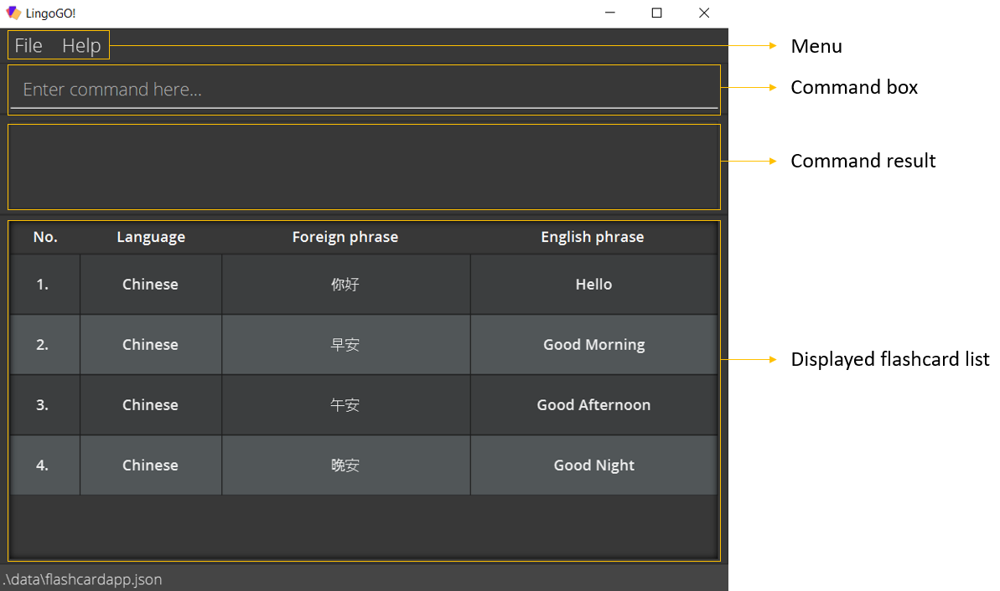
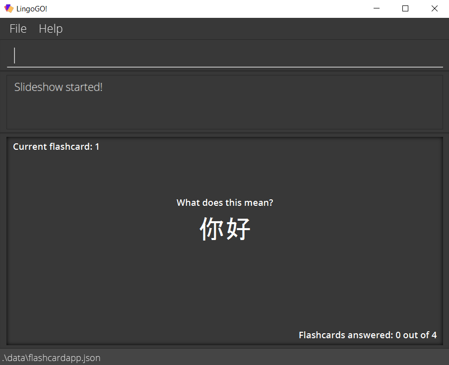
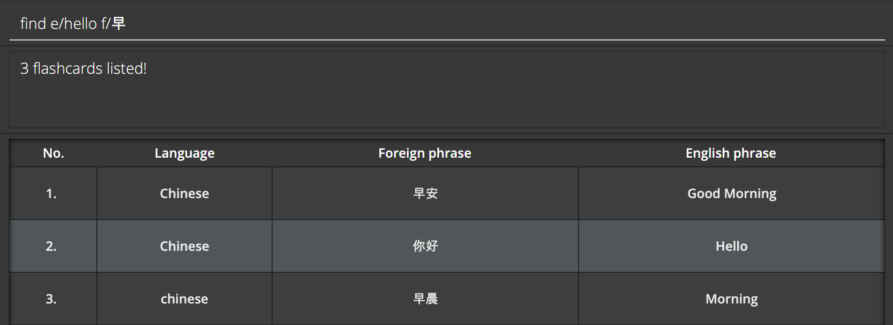
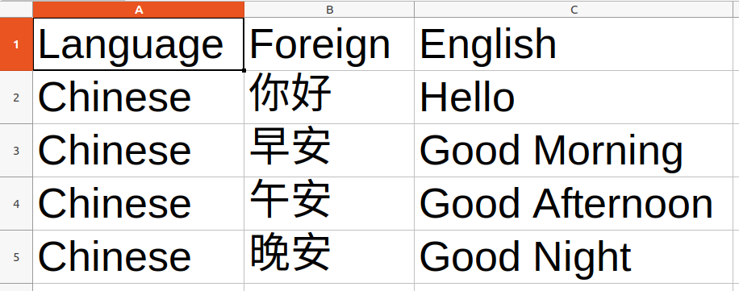

 

LingoGO! is a **desktop app** for **university students who use English as their first language** and are trying to **learn a
new language**. Founded on the widely established learning technique of **spaced-repetition**, LingoGO! takes all the
benefits of pen-and-paper flashcards in learning, and brings them to the next level with our **powerful indexing** and **sharing
features** -- *without the hassle* of managing actual physical ones. Coupled with our unique **Command Line Interface (CLI)** and
an elegant **Graphical User Interface (GUI)** to accompany it, LingoGO! is sure to delight you, and empower you on your
journey in mastering the new language you *have always wanted*.

LingoGO! currently supports **all languages that can be represented on your computer** and has the following main features:
* Addition, deletion, and editing of flashcards.
* Finding and filtering of flashcards by keywords and conditions.
* Importing and exporting of flashcards to be shared with others.
* Testing your knowledge in a questionnaire of flashcards.

Detailed information about these features can be found under the [Modes](#modes) and [Commands](#commands) sections in this user guide.

<h2 id="table-of-contents">Table of Contents</h2>

* Table of Contents
{:toc}

--------------------------------------------------------------------------------------------------------------------

## Purpose of the user guide
This user guide aims to help users familiarise themselves with the commands of LingoGO! and use the application effectively.

## How to use the user guide
* A [Table of Contents](#table-of-contents) with clickable links can be found above to help with navigating across the user guide quickly.
* New users can refer to the [Quick Start](#quick-start) guide for a quick set-up tutorial.
* New users can also refer to [Modes](#modes) to start understanding how to use LingoGO!.
* A detailed outline of the commands can be found under [Commands](#commands).
* Experienced users can refer to the [Command Summary](#command-summary) for a quick overview of all the commands in LingoGO!.
* A [Glossary](#glossary) is provided to help explain certain important terms used in this guide.

--------------------------------------------------------------------------------------------------------------------

## Quick start

1. Ensure you have **Java 11 or above installed** in your Computer (you may download Java from [here](https://www.oracle.com/java/technologies/downloads/)).

1. Download the latest *lingogo.jar* from [here](https://github.com/AY2122S1-CS2103T-T11-2/tp/releases).

1. Copy the file to the folder you want to use as the home folder for LingoGO!.

1. Double-click the file to start the app. Upon opening the app, you will be greeted with a welcome message. After acknowledging,
you will see the following [GUI](#gui) with some sample flashcards.

   

    Below is an overview of the [GUI](#gui), with the corresponding number label:
   1. <u>Menu</u>
     * A clickable menu bar.
   1. <u>Command box</u>
      * Type a command into the command box and press Enter to execute it.
      * Some example commands you can try (refer to the [Commands](#commands) section below for a full list of commands and their details):
        * `list` : Lists all flashcards.
        * `add l/Chinese e/Good Morning f/早安` : Adds a flashcard with the `Chinese` language, English phrase `Good Morning`, and corresponding foreign phrase `早安`.
        * `delete 3` : Deletes the 3rd flashcard shown in the displayed flashcard list of [List mode](#list-mode).
        * `find e/Good Morning` : Finds flashcard(s) with the matching English phrase `Good Morning`.
        * `filter l/Chinese` : Shows only the flashcard(s) with the `Chinese` language in the displayed flashcard list of [List mode](#list-mode).
   1. <u>Command result</u>
     * Shows a message after you execute a command.
   1. <u>Displayed flashcard list</u>
     * Shows a list of your flashcards.

--------------------------------------------------------------------------------------------------------------------

## Modes

Before diving into the specific commands, let's have an overview of the different modes in LingoGO!.

LingoGO! has two main modes, [List mode](#list-mode) and [Slideshow mode](#slideshow-mode), through which users can interact with
the application. At a high level, List mode provides an intuitive table overview to manage flashcards with our powerful and flexible indexing features. In contrast, Slideshow mode allows users to test their knowledge on selected flashcards one by one in a questionnaire-style interface while retaining the feel and look of traditional flashcards.

The following two sections will describe these modes in further detail.

### List mode

Below is an example of what LingoGO! looks like in List mode.

LingoGO! always starts in List mode and displays all of your flashcards.

List mode lets you [`add`](#adding-a-flashcard-add), [`delete`](#deleting-a-flashcard--delete),
[`edit`](#editing-a-flashcard--edit), [`import`](#importing-flashcards--import), and [`export`](#exporting-flashcards--export)
flashcards.

List mode also lets you choose what flashcards to display. The displayed flashcards
will be the flashcards you get tested on when you switch to [Slideshow mode](#slideshow-mode).
You can use the [`list`](#listing-flashcards--list), [`filter`](#filtering-flashcards-by-conditions-filter), or
[`find`](#locating-flashcards-by-keywords-find) command to choose which flashcards to display.

### Slideshow mode

Below is an example of what LingoGO! looks like in Slideshow mode.

Slideshow mode tests your knowledge by showing you flashcards one at a time. The flashcards shown to you are the ones
displayed in list mode.

To enter and exit slideshow mode, use the [`slideshow`](#testing-with-a-set-of-flashcards--slideshow) and [`stop`](#exiting-slideshow-mode-stop) commands respectively.

In slideshow mode, you can:
* Move to [`next`](#moving-to-the-next-flashcard-in-slideshow-mode--next) or
  [`previous`](#moving-to-the-previous-flashcard-in-slideshow-mode--previous) flashcards
* Enter an [`answer`](#answering-a-flashcard--answer) for a flashcard

**:information_source: Notes about slideshow mode:** 

* If your flashcards have phrases that are too long to be displayed, you can **increase the app's window size**.

## Commands

The following section gives an in-depth overview of each command in the application, and provides some examples on their usages.

**:information_source: Notes about the command format:** 

* Words in `UPPER_CASE` are parameters to be supplied by you.
  * e.g. a usage of `add l/LANGUAGE e/ENGLISH_PHRASE f/FOREIGN_PHRASE` could be `add l/Chinese e/Good Morning f/早安`.

* Items in square brackets are optional.
  * e.g. `edit INDEX [l/LANGUAGE] [e/ENGLISH_PHRASE] [f/FOREIGN_PHRASE]` can be used as `edit 1 l/Chinese e/Good Morning f/早安` or `edit 1 e/Good Morning`.

* Parameters can be in any order.
  * e.g. if the command specifies `add l/LANGUAGE e/ENGLISH_PHRASE f/FOREIGN_PHRASE`, `add f/FOREIGN_PHRASE l/LANGUAGE e/ENGLISH_PHRASE` is also acceptable.

* If a parameter is expected only once, but you specified it multiple times, only the last occurrence will be taken.
  * e.g. `edit 2 e/Hi e/Hello` is the same as `edit 2 e/Hello`.

* Extraneous parameters for commands that do not take in parameters (such as `help` and `clear`) will be ignored.
  * e.g. `help 123` is the same as `help`.

### Adding a flashcard: `add`

Adds a flashcard to LingoGO!.
* This command can only be run in [List mode](#list-mode).
* The flashcard will be added to the bottom of the displayed flashcard list in [List mode](#list-mode).

Format: `add l/LANGUAGE e/ENGLISH_PHRASE f/FOREIGN_PHRASE`

**:information_source: Notes about adding flashcards:** 

* `ENGLISH_PHRASE` and `FOREIGN_PHRASE` should not be longer than **100 characters**.
  For optimal viewing experience, flashcard phrases should be kept as short as possible.
  If your phrases are too long to be displayed, you can **increase the app's window size**.
* `LANGUAGE` should not be longer than **50 characters**.
* Make sure that you are able to distinguish between the different foreign phrases, otherwise the [`answer`](#answering-a-flashcard--answer) command in [Slideshow mode](#slideshow-mode) would not be beneficial for your testing of knowledge.

* `LANGUAGE` only allows alphabetic characters which will be **capitalized** when the flashcard is added (e.g. "CHINESE" will be saved as "Chinese").
* `ENGLISH_PHRASE` is not restricted to alphabetic characters, it is **recommended** that users ensure that `ENGLISH_PHRASE` is a valid English input.

Examples:
* `add l/Chinese e/Good Morning f/早安`

### Answering a flashcard : `answer`

Checks whether the English phrase of a flashcard matches the phrase you provide.
* This command can only be run in [Slideshow mode](#slideshow-mode).

Format: `answer e/ENGLISH_PHRASE`

* Checks the English phrase of the displayed flashcard against the `ENGLISH_PHRASE` you provide.
* The app will then show the correct English phrase and tell you whether you got it right.
* `ENGLISH_PHRASE` is not case-sensitive (e.g. "HeLLo" matches "hello").
* You can only answer a flashcard in [Slideshow mode](#slideshow-mode), and you can only answer it once.

Examples:
* `answer e/hello` checks the English phrase of the flashcard on display to see if `hello` matches it.

### Clearing all flashcards : `clear`

Clears all flashcards from LingoGO!.
* This command can only be run in [List mode](#list-mode).

Format: `clear`

### Deleting a flashcard : `delete`

Deletes the specified flashcard from LingoGO!.
* This command can only be run in [List mode](#list-mode).

Format: `delete INDEX`

* Deletes the flashcard at the specified `INDEX`.
* `INDEX` refers to the index number of the flashcard shown in [List mode](#list-mode).
* `INDEX` **must be a positive integer** 1, 2, 3, …

Examples:
* `list` followed by `delete 2` deletes the 2nd flashcard in the displayed flashcard list of [List mode](#list-mode).
* `find Hello` followed by `delete 1` deletes the 1st flashcard in the displayed flashcard list of [List mode](#list-mode), following the results of the `find` command.

### Editing a flashcard : `edit`

Edits an existing flashcard in LingoGO!.
* This command can only be run in [List mode](#list-mode).

Format: `edit INDEX [l/LANGUAGE] [e/ENGLISH_PHRASE] [f/FOREIGN_PHRASE]`

* Edits the flashcard at the specified `INDEX`.
* `INDEX` refers to the index number of the flashcard shown in [List mode](#list-mode).
* `INDEX` **must be a positive integer** 1, 2, 3, …​
* **At least one** of the optional fields must be provided.

**:information_source: Notes about editing flashcards:** 

* `ENGLISH_PHRASE` and `FOREIGN_PHRASE` should not be longer than **100 characters**.
  For optimal viewing experience, flashcard phrases should be kept as short as possible.
  If your phrases are too long to be displayed, you can **increase the app's window size**.

Examples:
* `edit 1 l/German` Edits the language of the 1st flashcard in the displayed flashcard list of [List mode](#list-mode) to be `German`.
* `edit 1 e/Good Morning` Edits the English phrase of the 1st flashcard in the displayed flashcard list of [List mode](#list-mode) to be `Good Morning`.
* `edit 2 f/Guten Morgen` Edits the foreign phrase of the 2nd flashcard in the displayed flashcard list of [List mode](#list-mode) to be `Guten Morgen`.
* `edit 2 l/German e/Good Morning f/Guten Morgen` Edits the language, English phrase, and foreign phrase of the 2nd flashcard in the displayed flashcard list of [List mode](#list-mode) to be `German`, `Good Morning`, and `Guten Morgen` respectively.

### Exiting LingoGO! : `exit`

Exits the app.
* This command can be run in both [List mode](#list-mode) and [Slideshow mode](#slideshow-mode).

Format: `exit`

### Exporting flashcards : `export`

Exports the currently displayed flashcards in [List mode](#list-mode) to a CSV file.
* This command can only be run in [List mode](#list-mode).

**:information_source: Notes about opening CSV files with Excel:** 
* We advise changing the default settings so that foreign language is properly displayed with Excel.
[Please refer here for detailed instructions.](https://www.itg.ias.edu/content/how-import-csv-file-uses-utf-8-character-encoding-0)

:exclamation: **Caution:**
If you export to a file that already exists in the data folder, the file will get overwritten

Format: `export CSV_FILE_NAME`

* Provides a file name with a .csv extension in which the flashcards will be stored and exported.
* The exported file will be added to the *data* folder (located in the same folder as the *lingogo.jar* file).
* The CSV file will have **3 columns** in this order from left to right:
  1. Language
  1. Foreign phrase
  1. English phrase

Examples:
* `export myCards.csv` will save all cards in LingoGO! to a CSV file named `myCards.csv`.

### Filtering flashcards by condition(s): `filter`

Filters flashcards based on specified condition(s), such that only flashcards matching **any of the given conditions** remain in the displayed flashcard list of [List mode](#list-mode).
* This command can only be run in [List mode](#list-mode).

Format: `filter [l/LANGUAGE] [i/INDEX_LIST] [r/INDEX_RANGE]`

* The `filter` search will apply **only on flashcards in the displayed flashcard list of [List mode](#list-mode)**. 
  Flashcards not in the displayed flashcard list will not subsequently show up even if a `filter` command with matching conditions is executed. 
  (Refer to the last `filter` example).
* `LANGUAGE` is not **case-sensitive** (e.g. "Chinese" matches "CHINESE").
* `INDEX_LIST` is a list of space separated indices, that refer to the indices shown in the displayed flashcard list of [List mode](#list-mode).
* `INDEX_RANGE` is a pair of space separated indices, that refer to the indices shown in the displayed flashcard list of [List mode](#list-mode).
  The given range is inclusive, that is `1 3` would refer to the flashcards at indices 1, 2 and 3. Additionally, the first given
  index must be smaller or equal to the second given index. e.g. `1 2`, `3 14` are accepted but not `1 2 3` nor `3 1`.
* The indices **must be positive integers** 1, 2, 3, …
* **At least one** of the optional fields must be provided.

Examples:
* `filter l/Chinese` returns all flashcards in the displayed flashcard list of [List mode](#list-mode) with the `Chinese` language like `e/Good Morning f/早安 l/Chinese`.
* `filter i/1 2 3` returns the flashcards in the displayed flashcard list of [List mode](#list-mode) indexed at 1, 2 and 3.
* `filter r/2 4` returns all the flashcards in the displayed flashcard list of [List mode](#list-mode) indexed from 2 to 4.
* `filter i/1 3 6 l/Tamil` returns all the flashcards in the displayed flashcard list of [List mode](#list-mode) indexed at 1, 3 and 6, **or** of `Tamil` language.
* `filter l/Chinese r/1 4` returns all the flashcards in the displayed flashcard list of [List mode](#list-mode) indexed from 1 to 4, **or** of `Chinese` language.
* `filter l/French r/1 10 i/15 19 20` returns all flashcards in the displayed flashcard list of [List mode](#list-mode) indexed from 1 to 10 **or** 
  indexed at 15, 19 and 20  **or** of the `French` language.
*  When the displayed flashcard list of [List mode](#list-mode) shows `e/Good Morning f/早安 l/Chinese` and 
   `e/hand f/손 l/Korean`, executing `filter l/Korean` will return a displayed flashcard list with only the `e/hand f/손 l/Korean` 
   flashcard left. If we then execute `filter l/Chinese`, an empty displayed flashcard list will be returned. 

### Locating flashcards by keyword(s): `find`

Finds flashcards from the **entire** flashcard list based on the keyword(s) specified.
* This command can only be run in [List mode](#list-mode).

Format: `find [e/ENGLISH_KEYWORDS] [f/FOREIGN_KEYWORDS]`

* The search for english keywords is **not case-sensitive**, e.g "HELLO" will match "Hello".
* The search for foreign keywords is **case-sensitive** because some language depends on capitalization rules, e.g. in German, "Morgen" translates to "morning" but "morgen" translates to "tomorrow".
* The **order** of the keywords **does not matter**, e.g. "Good morning" will match "Morning good".
* Only **full words** will be matched for **English keywords**, e.g. "Fire" will **not** match "Fireworks".
* **Non-full words** match will be accepted for **foreign keywords**, e.g. "早" with match "早安".
* Flashcard(s) **matching at least one keyword** will be displayed.
* **At least one** of the optional fields must be provided.

Examples:
* `find e/HELLO` returns `e/Hello f/你好`
* `find f/早` returns `e/Good Morning f/早安` and `e/Morning f/早晨`
* `find e/Hello f/早` returns `e/Hello f/你好`, `e/Good Morning f/早安` and `e/Morning f/早晨`

   

### Viewing help : `help`

Shows a message explaining how to access the help page, as well as dropdowns with brief explanations
for each command.
* This command can be run in both [List mode](#list-mode) and [Slideshow mode](#slideshow-mode).

Format: `help`

### Importing flashcards : `import`

**:information_source: Notes about importing CSV files made with Excel:** 
* We advise against using Excel to create a CSV file to be imported into LingoGO!.

Imports flashcards from a CSV file and **adds** them to the existing list in LingoGO!
(instead of replacing the current list)
* This command can only be run in [List mode](#list-mode).

Format: `import CSV_FILE_NAME`

* Place the CSV file that you wish to import in the *data* folder
 (located in the same folder as the *lingogo.jar* file).
* The CSV file must have exact headers "Language, Foreign, English". (as shown in the below example)
* The headers in the CSV file are case-sensitive.
* The CSV file must have **3 columns** in this order from left to right:
  1. Language
  2. Foreign phrase
  3. English phrase

**:information_source: Importing invalid CSV file:** 
* If any of the above required information in the CSV file is invalid or missing,
LingoGO! will **not** import the flashcards

Below is an example of how the CSV file might look like.
     

Examples:
* `import dictionary.csv` will add all flashcards stored in the CSV file dictionary.csv to LingoGO!.

### Listing flashcards : `list`

Shows a list of flashcards in LingoGO!.
* This command can only be run in [List mode](#list-mode).

Format: `list [NUMBER_OF_FLASHCARDS]`

* Lists flashcards in LingoGO!
* If `[NUMBER_OF_FLASHCARDS]` is provided, randomly select `[NUMBER_OF_FLASHCARDS]` flashcards from the entire application to be shown in [List mode](#list-mode)
* The `[NUMBER_OF_FLASHCARDS]` **must be a positive integer** 1, 2, 3, …

Examples:
* `list` returns all flashcards in LingoGO!.
* `list 3` returns 3 randomly selected flashcards in LingoGO!

### Moving to the next flashcard in slideshow mode : `next`

Goes forward to the next flashcard (if there is one) in [Slideshow mode](#slideshow-mode).
* This command can only be run in [Slideshow mode](#slideshow-mode).

Format: `next`

### Moving to the previous flashcard in slideshow mode : `previous`

Goes back to the previous flashcard (if there is one) in [Slideshow mode](#slideshow-mode).
* This command can only be run in [Slideshow mode](#slideshow-mode).

Format: `previous`

### Testing with a set of flashcards : `slideshow`

Switches to [Slideshow mode](#slideshow-mode) for you to test yourself using the flashcards shown in [List mode](#list-mode).
* This command can only be run in [List mode](#list-mode).

Format: `slideshow`

### Exiting slideshow mode: `stop`

Exits [Slideshow mode](#slideshow-mode) and returns to [List mode](#list-mode).
* This command can only be run in [Slideshow mode](#slideshow-mode).

Format: `stop`

## Data

### Saving the data

LingoGO!'s data is saved in the hard disk automatically after any command that changes its data. There is no need to save manually.

### Editing the data file

LingoGO!'s data is saved as a JSON file at `{JAR file location}/data/lingogo.json`. Advanced users are welcome to update data directly by editing that data file.

:exclamation: **Caution:**
  1. If your changes to the data file makes its format invalid, LingoGO! will discard all data and start with an empty data file on the next run.
  2. Some changes to the JSON file, such as the adding of extraneous JSON fields, may be ignored and overwritten upon the next LingoGO! command.

--------------------------------------------------------------------------------------------------------------------

## Glossary

### CSV
A CSV file, short for comma-separated values, is a special text file that uses commas for formatting.

### GUI
A GUI, short for graphical user interface, is a visual display through which users can interact with the application.

## FAQ

**Q**: How do I transfer my data to another computer? 
**A**: Install the app in the other computer and overwrite the empty data file it creates with the file that contains the data of your previous LingoGO! home folder.

--------------------------------------------------------------------------------------------------------------------

## Command summary

Action | Format | Example
--------|----------|--------
**Add** | `add l/LANGUAGE e/ENGLISH_PHRASE f/FOREIGN_PHRASE` | `add l/Chinese e/Good Morning f/早安`
**Answer** | `answer e/ENGLISH_PHRASE` | `answer e/hello`
**Clear** | `clear` | `clear`
**Delete** | `delete INDEX` | `delete 3`
**Edit** | `edit INDEX [l/LANGUAGE] [e/ENGLISH_PHRASE] [f/FOREIGN_PHRASE]` | `edit 2 f/Guten Morgen`
**Exit** | `exit` | `exit`
**Export** | `export FILE_NAME` | `export myCards.csv`
**Filter** | `filter [l/LANGUAGE] [i/INDEX_LIST] [r/INDEX_RANGE]` | `filter l/Chinese r/1 4 i/1 2 3`
**Find** | `find [e/ENGLISH_KEYWORDS] [f/FOREIGN_KEYWORDS]` | `find e/Hello f/早`
**Help** | `help` | `help`
**Import** | `import CSV_FILE_PATH` | `import dictionary.csv`
**List** | `list [NUMBER_OF_FLASHCARDS]` | `list 4`
**Next** | `next` | `next`
**Previous** | `previous` | `previous`
**Slideshow** | `slideshow` | `slideshow`
**Stop** | `stop` | `stop`
